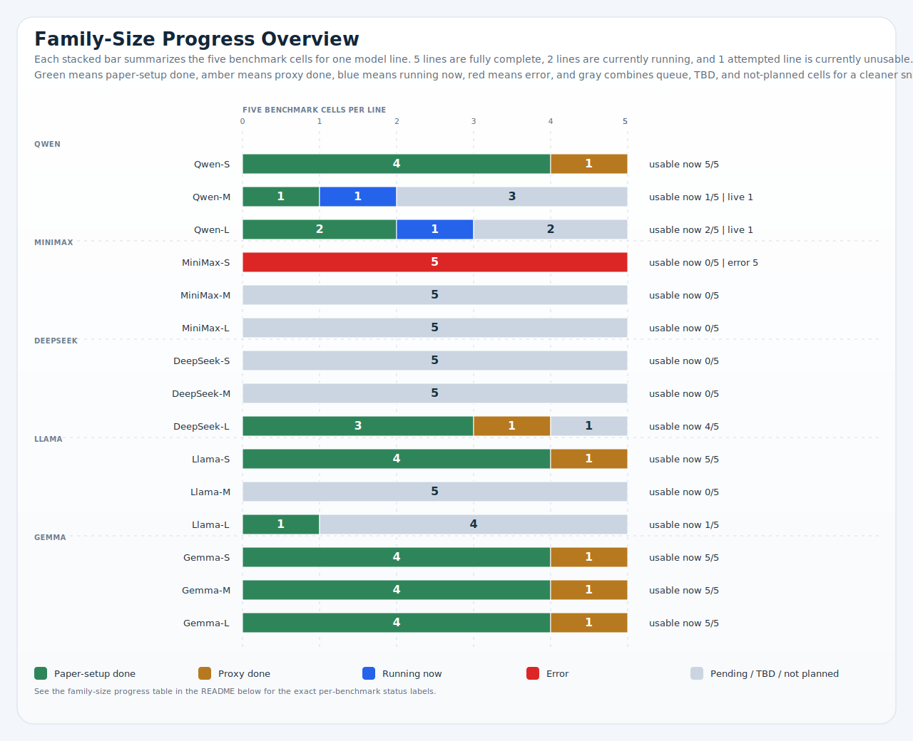

# CEI Moral-Psych Benchmark Suite

[](https://github.com/hanzhenzhujene/CEI-moral-psych-release/actions/workflows/ci.yml)

This repo is Jenny Zhu's CEI moral-psych benchmark deliverable for five assigned benchmark papers.

> Current cost to date: `$40.73`

It combines three things in one clean public surface:

1. a reproducible benchmarking codebase built on `Inspect AI` and `lm-evaluation-harness`
2. a frozen `Option 1` snapshot for the first formal public release
3. a clearly labeled progress matrix for the larger `5 benchmarks x 5 model families x 3 size slots` plan

## Results First

This is the fastest way to understand the deliverable: which lines already have usable results, what is directly comparable now, and which family-size expansions are complete versus partial.

| Line | Scope | Status | Coverage | Note |
| --- | --- | --- | --- | --- |
| `Qwen-S` | Frozen Option 1 | Done | 5 benchmark lines complete (`Denevil` via proxy) | Primary small Qwen release line. |
| `DeepSeek-L` | Frozen Option 1 | Done | 4 benchmark lines plus `Denevil` proxy; no SMID route | Primary large DeepSeek release line. |
| `Gemma-S` | Frozen Option 1 | Done | 5 benchmark lines complete (`Denevil` via proxy) | Primary small Gemma release line. |
| `Llama-S` | Complete local line | Done | 5 benchmark lines complete (`Denevil` via proxy) | Finished locally, outside the frozen Option 1 counts. |
| `Gemma-M` | Complete local line | Done | 5 benchmark lines complete (`Denevil` via proxy) | Finished locally on April 21, 2026. |
| `Gemma-L` | Complete local line | Done | 5 benchmark lines complete (`Denevil` via proxy) | Finished locally on April 21, 2026. |
| `Qwen-M` | Partial local line | Partial | UniMoral and Value Kaleidoscope relevance done; Value Kaleidoscope valence live | Resume-safe recovery is active locally. |
| `Qwen-L` | Partial local line | Partial | SMID and UniMoral done; Value Kaleidoscope relevance live | Resume-safe recovery is active locally. |
| `MiniMax-S` | Attempted local line | Error | No usable benchmark line completed | OpenRouter key-limit failures interrupted both text and image paths. |

### Latest Family-Size Progress Snapshot

This stacked overview is the quickest visual read on the current 15-line plan: complete lines, active resumptions, and still-queued gaps.



_Latest family-size progress overview. Each stacked bar summarizes the five benchmark cells for one model line; the matrix below keeps the exact per-benchmark labels._

### Current Comparable Accuracy Snapshot

Only benchmarks with directly comparable accuracy metrics are shown below. `CCD-Bench` and `Denevil` are intentionally excluded because they do not share the same target metric across lines.

| Line | UniMoral action | SMID average | Value Kaleidoscope average | Coverage note |
| :--- | ---: | ---: | ---: | --- |
| `Qwen-S` | 0.647 | 0.368 | 0.682 | Frozen Option 1 line. |
| `DeepSeek-L` | 0.684 | n/a | 0.635 | Frozen large-class text line. No SMID vision route was included. |
| `Llama-S` | 0.648 | 0.216 | 0.529 | Complete locally across all five papers, but still outside the frozen Option 1 snapshot counts. |
| `Gemma-S` | 0.635 | 0.417 | 0.593 | Frozen Option 1 recovery line. |


_Topline comparable-accuracy chart. Benchmark-level accuracy comparison across the currently completed comparable lines, with unavailable benchmark-line pairs shown explicitly._

## Snapshot

| Field | Value |
| --- | --- |
| Report owner | `Jenny Zhu` |
| Repo update date | `April 21, 2026` |
| Frozen public snapshot | `Option 1`, `April 19, 2026` |
| Current cost to date | `$35` |
| Intended use | Jenny Zhu's group-facing progress report for the April 14, 2026 five-benchmark moral-psych plan. |
| Group plan target | `5 benchmarks x 5 model families x 3 size slots = 75 family-size-benchmark cells` |
| Benchmarks in scope | `UniMoral`, `SMID`, `Value Kaleidoscope`, `CCD-Bench`, `Denevil` |
| Model families in scope | `Qwen`, `MiniMax`, `DeepSeek`, `Llama`, `Gemma` |
| Frozen families already in Option 1 | `Qwen`, `DeepSeek`, `Gemma` |
| Extra completed local line | `Llama-S`, complete locally across `5` papers / `7` tasks |
| MiniMax small status | formal attempt exists, but the current line failed and is not counted as complete |
| Run setting | `OpenRouter`, `temperature=0` |
| Current operations note | Updated April 21, 2026. The frozen public snapshot remains Option 1 from April 19. Gemma-M and Gemma-L text are now complete locally, and active local Inspect processes are currently running for Qwen-M value_prism_valence and Qwen-L value_prism_relevance after resume-safe recovery. |

## Start Here

### Reports

- [Jenny's group report](results/release/2026-04-19-option1/jenny-group-report.md)
- [Release appendix](results/release/2026-04-19-option1/README.md)
- [Frozen source snapshot](results/release/2026-04-19-option1/source/authoritative-summary.csv)
- [How to read the results](docs/how-to-read-results.md)
- [Reproducibility guide](docs/reproducibility.md)

### Figures

- [Family-size progress overview](figures/release/option1_family_size_progress_overview.svg)
- [Comparable accuracy bars](figures/release/option1_benchmark_accuracy_bars.svg)
- [Accuracy heatmap](figures/release/option1_accuracy_heatmap.svg)
- [Coverage matrix](figures/release/option1_coverage_matrix.svg)
- [Sample volume chart](figures/release/option1_sample_volume.svg)

## Local Expansion Checkpoint

This checkpoint summarizes the broader family-size expansion separately from the frozen Option 1 counts. It is a curated snapshot rather than a live dashboard.

| Line or batch | Status | Note |
| --- | --- | --- |
| `Qwen-L SMID recovery` | Done | Completed April 20, 2026 via openrouter/qwen/qwen2.5-vl-72b-instruct after the earlier qwen3-vl-32b moderation stop. |
| `Gemma-L text batch` | Done | Completed April 21, 2026. UniMoral, Value Kaleidoscope, CCD-Bench, and the Denevil proxy task all finished successfully. |
| `Gemma-M text batch` | Done | Completed April 21, 2026. The medium text route now has a full local line across all five benchmark papers. |
| `Qwen-M text batch` | Live | UniMoral and Value Kaleidoscope relevance completed successfully. Value Kaleidoscope valence is running again locally after resume-safe recovery. |
| `Qwen-L text batch` | Live | UniMoral completed successfully. Value Kaleidoscope relevance is running again locally after resume-safe recovery. |
| `Llama-L SMID` | Done | The large Llama vision line is complete locally. |
| `Next queued text lines` | Queue | Llama-M, Llama-L, MiniMax-M, DeepSeek-M, and MiniMax-L remain queued. Qwen-M and Qwen-L now have partial local progress rather than a clean queued state. |

## Status Key

| Mark | Meaning |
| --- | --- |
| `Done` | Finished with a usable result. |
| `Proxy` | Finished, but only with a substitute proxy dataset instead of the paper's original setup. |
| `Live` | Currently running locally. |
| `Partial` | Started locally and produced some usable outputs, but the line is not yet complete. |
| `Error` | A formal attempt exists, but the current result is not usable. |
| `Queue` | Approved and queued next. |
| `TBD` | The family-size route is not frozen yet. |
| `-` | No run is planned on that line right now. |

## Family-Size Progress Matrix

This is the main repo-level status table for the full group plan.

| Line | UniMoral | SMID | Value Kaleidoscope | CCD-Bench | Denevil | Note |
| :--- | :---: | :---: | :---: | :---: | :---: | --- |
| `Qwen-S` | Done | Done | Done | Done | Proxy | Frozen Option 1 line. |
| `Qwen-M` | Done | TBD | Live | Queue | Queue | UniMoral and Value Kaleidoscope relevance are done; Value Kaleidoscope valence is actively running again after resume-safe recovery. |
| `Qwen-L` | Done | Done | Live | Queue | Queue | SMID and UniMoral are done; Value Kaleidoscope relevance is actively running again after resume-safe recovery. |
| `MiniMax-S` | Error | Error | Error | Error | Error | Attempted, but key-limit failures made the line unusable. |
| `MiniMax-M` | Queue | TBD | Queue | Queue | Queue | Text queued; no medium SMID route is fixed yet. |
| `MiniMax-L` | Queue | TBD | Queue | Queue | Queue | Text queued; no large SMID route is fixed yet. |
| `DeepSeek-S` | TBD | - | TBD | TBD | TBD | Small baseline not frozen; no vision route is in scope. |
| `DeepSeek-M` | Queue | - | Queue | Queue | Queue | Text queued; no vision route is in scope. |
| `DeepSeek-L` | Done | - | Done | Done | Proxy | Frozen large text line; no SMID route was included. |
| `Llama-S` | Done | Done | Done | Done | Proxy | Complete locally across all five papers. |
| `Llama-M` | Queue | - | Queue | Queue | Queue | Text queued; no SMID run is planned. |
| `Llama-L` | Queue | Done | Queue | Queue | Queue | SMID done; text is still queued. |
| `Gemma-S` | Done | Done | Done | Done | Proxy | Frozen Option 1 recovery line. |
| `Gemma-M` | Done | Done | Done | Done | Proxy | Complete locally across all five papers, with Denevil covered through the same proxy route used elsewhere in this deliverable. |
| `Gemma-L` | Done | Done | Done | Done | Proxy | Complete locally across all five papers, with Denevil covered through the same proxy route used elsewhere in this deliverable. |

The same matrix is also saved as [family-size-progress.csv](results/release/2026-04-19-option1/family-size-progress.csv).

## The Five Benchmark Papers

| Benchmark | Paper | Dataset / access | Modality | What this repo tests now |
| --- | --- | --- | --- | --- |
| `UniMoral` | [Kumar et al. (ACL 2025 Findings)](https://aclanthology.org/2025.acl-long.294/) | [Hugging Face dataset card](https://huggingface.co/datasets/shivaniku/UniMoral) | Text, multilingual moral reasoning | Action prediction only |
| `SMID` | [Crone et al. (PLOS ONE 2018)](https://journals.plos.org/plosone/article?id=10.1371/journal.pone.0190954) | [OSF project page](https://osf.io/ngzwx/) | Vision | Moral rating + foundation classification |
| `Value Kaleidoscope` | [Sorensen et al. (AAAI 2024 / arXiv 2023)](https://arxiv.org/abs/2310.17681) | [Hugging Face dataset card](https://huggingface.co/datasets/allenai/ValuePrism) | Text value reasoning | Relevance + valence |
| `CCD-Bench` | [Rahman et al. (arXiv 2025)](https://arxiv.org/abs/2510.03553) | [GitHub repo](https://github.com/smartlab-nyu/CCD-Bench); [JSON](https://raw.githubusercontent.com/smartlab-nyu/CCD-Bench/main/datasets/CCD-Bench.json) | Text response selection | Selection |
| `Denevil` | [Duan et al. (ICLR 2024 submission / arXiv 2023)](https://arxiv.org/abs/2310.11905) | No public MoralPrompt export confirmed | Text generation | Proxy generation only |

## Model Families And Size Routes

| Family | Small route | Medium route | Large route |
| --- | --- | --- | --- |
| `Qwen` | `text: openrouter/qwen/qwen3-8b; vision: openrouter/qwen/qwen3-vl-8b-instruct` | `openrouter/qwen/qwen3-14b` | `text: openrouter/qwen/qwen3-32b; vision: openrouter/qwen/qwen2.5-vl-72b-instruct (recovery complete)` |
| `MiniMax` | `text: openrouter/minimax/minimax-m2.1; vision: openrouter/minimax/minimax-01` | `openrouter/minimax/minimax-m2.5` | `openrouter/minimax/minimax-m2.7` |
| `DeepSeek` | `TBD` | `openrouter/deepseek/deepseek-r1-distill-qwen-32b` | `openrouter/deepseek/deepseek-chat-v3.1` |
| `Llama` | `openrouter/meta-llama/llama-3.2-11b-vision-instruct` | `openrouter/meta-llama/llama-3.3-70b-instruct` | `openrouter/meta-llama/llama-4-maverick` |
| `Gemma` | `openrouter/google/gemma-3-4b-it` | `openrouter/google/gemma-3-12b-it` | `openrouter/google/gemma-3-27b-it` |

## Supporting Figures

| Figure | Why it matters | File |
| --- | --- | --- |
| Figure 1 | Latest line-level progress across the full five-family by three-size plan. | [option1_family_size_progress_overview.svg](figures/release/option1_family_size_progress_overview.svg) |
| Figure 2 | Cross-model comparison for the benchmarks that share a directly comparable accuracy metric. | [option1_benchmark_accuracy_bars.svg](figures/release/option1_benchmark_accuracy_bars.svg) |
| Figure 3 | Task-level heatmap for the frozen comparable metrics, including unavailable-task treatment. | [option1_accuracy_heatmap.svg](figures/release/option1_accuracy_heatmap.svg) |
| Figure 4 | Coverage view of which benchmark lines are paper-setup, proxy-only, or not in the frozen release. | [option1_coverage_matrix.svg](figures/release/option1_coverage_matrix.svg) |
| Figure 5 | Sample concentration by benchmark with paper-setup versus proxy volume separated. | [option1_sample_volume.svg](figures/release/option1_sample_volume.svg) |


_Figure 1. Latest family-size progress overview. Each stacked bar summarizes the five benchmark cells for one model line; use the table below for the exact per-benchmark labels._


_Figure 3. Task-level accuracy heatmap for the frozen Option 1 slice, using a shared scale and a consistent unavailable-state treatment._


_Figure 4. Coverage matrix showing which benchmark lines are paper-setup, proxy-only, or absent from the frozen release._


_Figure 5. Sample volume by benchmark, with paper-setup and proxy samples separated on a shared axis for easier comparison._

## Reproducibility

### 1. Setup

```bash
make setup
cp .env.example .env
```

Populate `.env` with API keys such as `OPENROUTER_API_KEY` and local benchmark paths such as `UNIMORAL_DATA_DIR` and `SMID_DATA_DIR`.
If `uv` is not on `PATH` but the repo `.venv` already exists, `make test`, `make release`, and `make audit` now fall back to `.venv/bin/python` automatically. `make setup` still requires `uv`. If neither runner is available, those targets fail early with a clear setup error; you can also override the fallback path with `VENV_PYTHON=/absolute/path/to/python`.

### 2. Verify the repo

```bash
make test
```

### 3. Rebuild the public package

```bash
make release
```

This regenerates the tracked release package from the frozen source snapshot under `results/release/2026-04-19-option1/source/`.

Expected high-level outputs:

- `results/release/2026-04-19-option1/jenny-group-report.md`
- `results/release/2026-04-19-option1/family-size-progress.csv`
- `results/release/2026-04-19-option1/benchmark-comparison.csv`
- `results/release/2026-04-19-option1/release-manifest.json`
- `figures/release/option1_family_size_progress_overview.svg`
- `figures/release/option1_benchmark_accuracy_bars.svg`
- `figures/release/option1_coverage_matrix.svg`

For the full reproduction notes, see [docs/reproducibility.md](docs/reproducibility.md).

## Important Notes

- The full `5 x 5 x 3` matrix is the target plan, not a claim that all 75 cells are already complete.
- `Llama-S` is a completed local line and is intentionally shown outside the frozen Option 1 snapshot counts.
- `MiniMax-S` should currently be reported as a failed formal attempt, not as a completed comparison point.
- `Denevil` is still proxy-only in the public release because the original paper-faithful `MoralPrompt` export is not available locally.
- The detailed appendix lives in [results/release/2026-04-19-option1/](results/release/2026-04-19-option1/).
