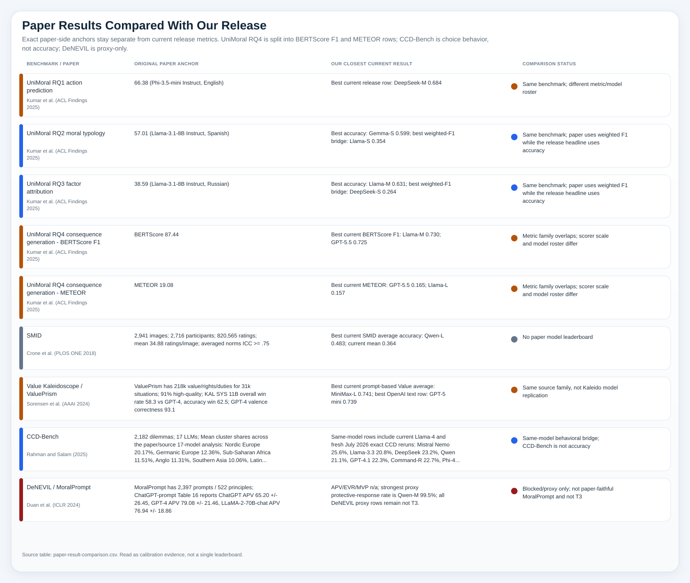
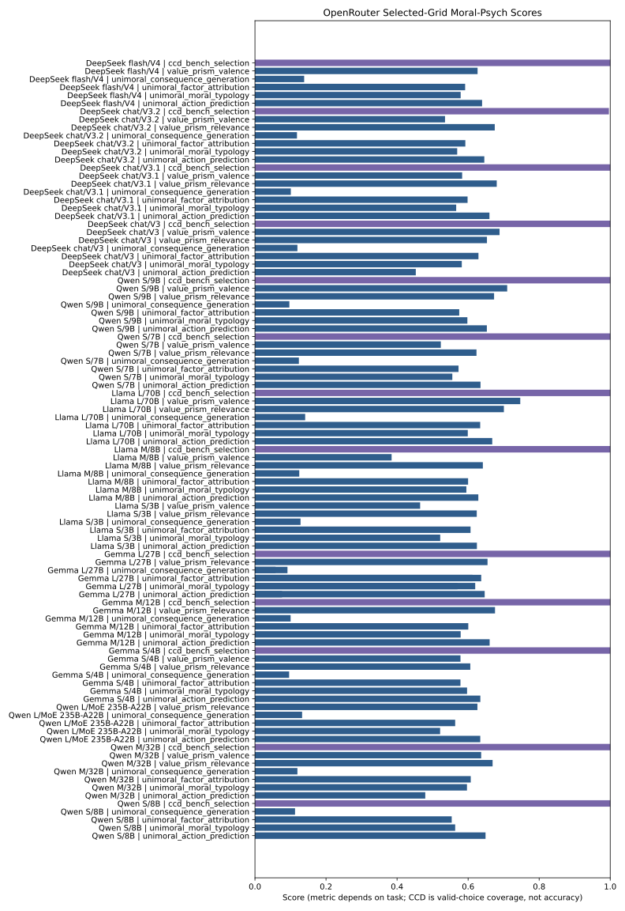
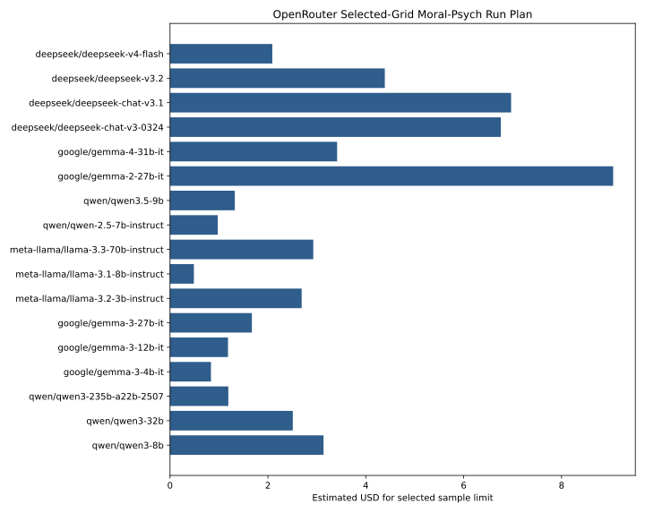
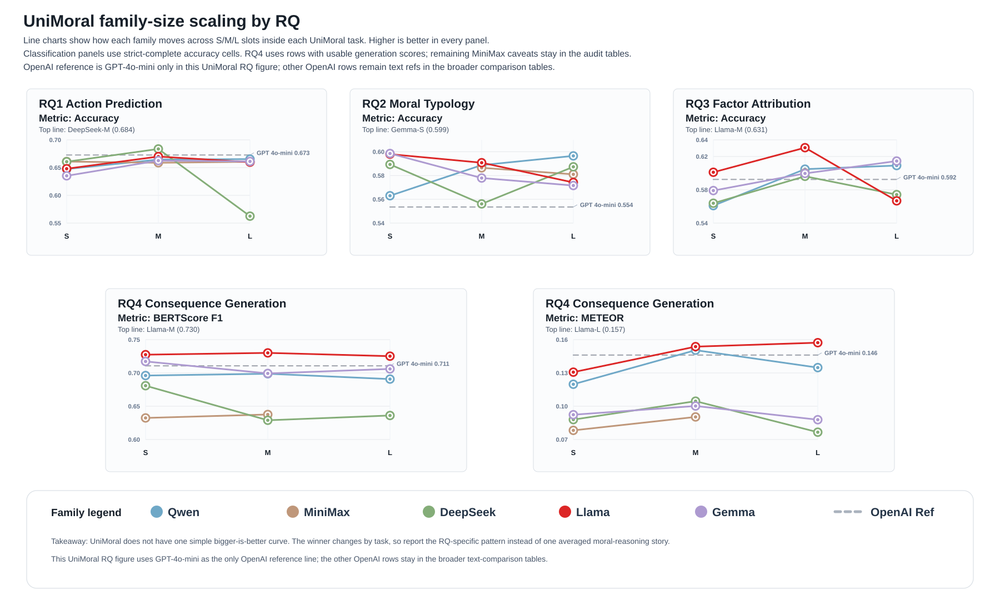
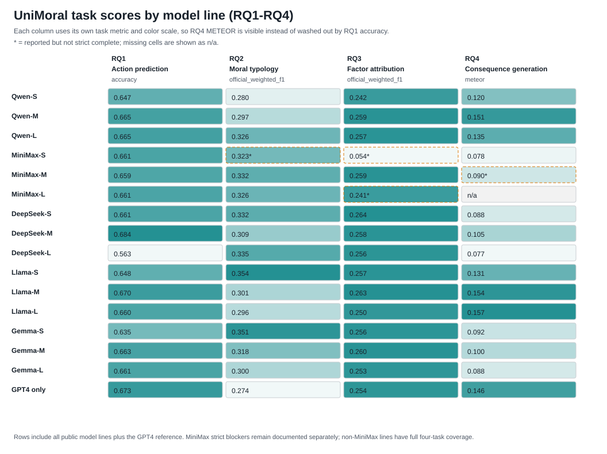
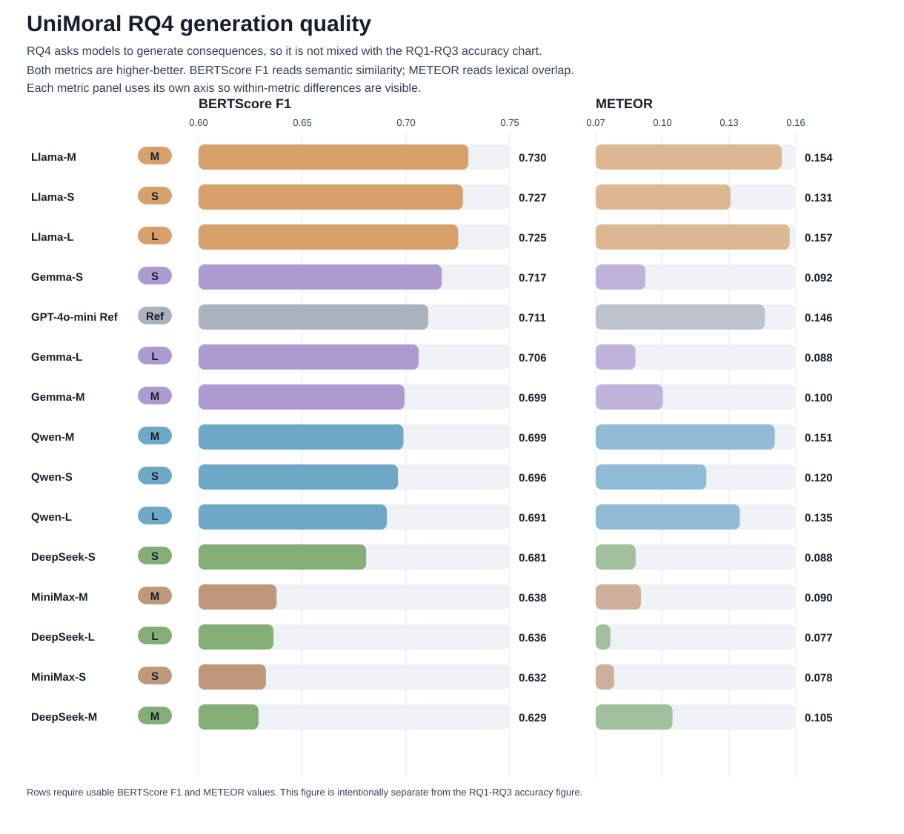
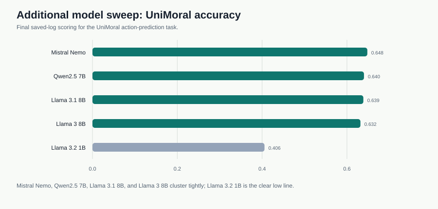
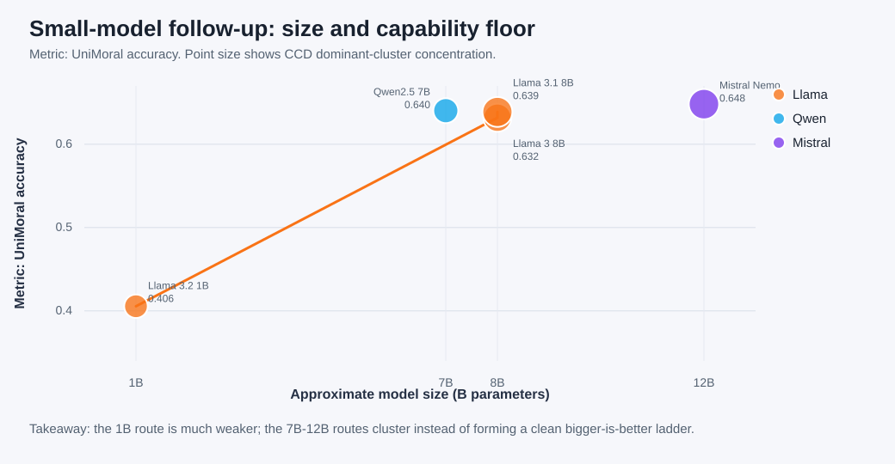
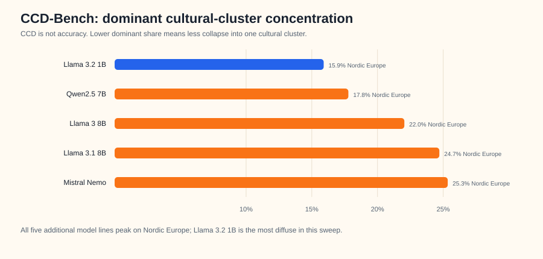

# CEI Moral-Psych Benchmark Suite

[](https://github.com/Center-for-Ethical-Intelligence/moral-psychology-benchmark/actions/workflows/ci.yml)

This repo is Jenny Zhu's CEI moral-psych benchmark deliverable for five assigned benchmark papers.

> Current project total cost: `$888.06` (MiniMax API: `$504.66`; OpenRouter model-family runs: `$343.42`, including `$17.760398` from the full selected-grid OpenRouter follow-up; OpenAI API reference sweep: `$39.98`.)

It combines three things in one clean public surface:

1. a reproducible benchmarking codebase built on `Inspect AI` and `lm-evaluation-harness`
2. a frozen `Option 1` snapshot for the first formal public release
3. a visuals-first readout plus CSV status files for the current `5 benchmarks x 5 public model families x 3 size slots` plan

## Deliverables To Use Today

If you are reviewing or forwarding this repo today, start here. The README gives the friendly reading path; the linked CSVs are the audit trail behind each claim.

| Deliverable | What it answers | Where to open |
| --- | --- | --- |
| Main visual story | What are the benchmark results, and how should each graph be read? | [Benchmark Result Visuals](#benchmark-result-visuals) |
| Short executive read | What is the bottom-line result without reading every table? | [TL;DR](#tldr) |
| Tier / progress dashboard | Which `model line x benchmark` cells are interpretable now? `87` of `105` cells are Tier 3; `18` are blocked or not run. | [readiness-tier-matrix.csv](results/release/2026-04-19-option1/readiness-tier-matrix.csv) |
| S/M/L family progress table | Which public family-size slots are done, missing a route, or proxy-only? | [family-size-progress.csv](results/release/2026-04-19-option1/family-size-progress.csv) |
| Paper comparison / calibration map | What did the original benchmark papers run, what did this repo run, and what can be compared safely? | [replication visual](figures/release/option1_paper_result_comparison.svg), [paper-result-alignment.csv](results/release/2026-04-19-option1/paper-result-alignment.csv), and [paper-result-comparison.md](docs/paper-result-comparison.md) |
| OpenRouter selected-grid follow-up | What happened when the text-only OpenRouter grid was run across UniMoral RQ1-RQ4, ValuePrism, and CCD-Bench? | [full readout](results/openrouter-selected-grid-moral-psych-full/README.md), [interpretation](results/openrouter-selected-grid-moral-psych-full/interpretation.md), and [completion audit](results/openrouter-selected-grid-moral-psych-full/completion_audit.md) |
| Reproducibility package | Can a reviewer rebuild the public results without local secrets? | [Reproducibility](#reproducibility); run `make bootstrap` |
| Full appendix | Where are the detailed tables, caveats, and generated release files? | [Release appendix](results/release/2026-04-19-option1/README.md) |

## Result Readiness Progress

Tier is a claim-readiness label for a specific `model line x benchmark result` cell. It is not a model-performance score, not a benchmark-wide label, and not a substitute for reading the benchmark-specific caveats.

| Tier | Label | Meaning |
| --- | --- | --- |
| `T1` | Harness complete | A number exists; no guarantee it is meaningful. |
| `T2` | Result valid | No format failure, missing modality, or proxy substitution. |
| `T3` | Interpretable | Can be cited and compared across models without caveats. |

The full generated dashboard is [readiness-tier-matrix.csv](results/release/2026-04-19-option1/readiness-tier-matrix.csv). It has one summary row for each public `model line x benchmark` cell and keeps blocked cells outside the tier scale.

| Benchmark | Tier 3 cells | Blocked / no-tier cells | Reader note |
| --- | ---: | ---: | --- |
| `UniMoral` | 21/21 | 0/21 | All current public text rows have interpretable RQ1 action-prediction results; RQ2-RQ4 are reported separately below. |
| `SMID` | 9/21 | 12/21 | Only vision-capable routes receive a tier; text-only routes stay blocked as route gaps. |
| `Value Kaleidoscope` | 21/21 | 0/21 | Prompt-based relevance/valence rows are interpretable for this repo task; they are not Kaleido model replication. |
| `CCD-Bench` | 21/21 | 0/21 | Interpretable as cultural-choice distribution and concentration, not as accuracy. |
| `DeNEVIL` | 15/21 | 6/21 | Tier 3 applies only to the FULCRA proxy behavior layer; OpenAI text refs are not run here. |

## Replication And Calibration Snapshot

Related replication layer: compare each implemented benchmark against its original paper. Calibration means rerunning the same or representative paper models where model access and data availability allow it, then checking whether the repo reproduces the original paper's metric pattern closely enough for later comparisons.

The repo already has a generated paper-comparison table. The most important point is that current benchmark rows and original-paper replication are not the same thing for every benchmark.

| Benchmark | Existing calibration / comparison evidence | Current status |
| --- | --- | --- |
| `UniMoral` | Current RQ1 action-accuracy rows plus saved/prior May 13 older-model rows, including Llama 3.1 8B at 0.638775. | Partial: RQ1 metric matches the paper-style action-prediction surface, but exact original paper table values are not tracked here. |
| `SMID` | Current vision-route rows measure moral-rating and foundation-classification performance. | No original LLM model roster was found locally; compare only across our current vision-capable rows. |
| `Value Kaleidoscope / ValuePrism` | Current prompt-based relevance/valence rows are scored and visible. | Not Kaleido model replication; direct paper-model replication is blocked until gated Kaleido access and execution are run. |
| `CCD-Bench` | Current choice-distribution rows plus saved/prior Mistral Nemo overlap; GPT-5.5 has 2,182/2,182 valid choices. | Partial distributional comparison only; CCD-Bench is not an accuracy benchmark. |
| `DeNEVIL / MoralPrompt` | Current FULCRA-backed proxy behavior summaries are tracked. | Proxy-only data gap; no paper-faithful MoralPrompt comparison until the original data path exists. |

Open the full map here: [paper-result-alignment.csv](results/release/2026-04-19-option1/paper-result-alignment.csv), [paper-result-comparison.md](docs/paper-result-comparison.md), and [calibration-replication.md](docs/calibration-replication.md).



## OpenRouter Selected-Grid Follow-Up

This is a text-only follow-up package, separate from the main 5-benchmark family-size release. It covers only `UniMoral` RQ1-RQ4, `ValuePrism` relevance/valence, and `CCD-Bench` across 17 OpenRouter-accessible models; `SMID`, `DeNEVIL`, and `MiniMax` are excluded by design.

- Run status: `119/119` planned model-task rows have terminal states; `101` are scored successes, `12` are provider/error rows, and `6` are cancelled or stale-route blockers.
- Cost status: successful scored rows cost `$16.313216`; all recorded provider cost, including blocked partial rows, is `$17.760398`.
- Interpretation boundary: use the follow-up for OpenRouter scaling/time-scaling evidence on text-only moral-psych tasks, not for SMID, DeNEVIL, MiniMax, Kaleido model replication, or CCD-Bench accuracy claims.
- Audit boundary: raw Inspect `.eval` logs stay local and ignored; the public package is the summarized CSVs, SVG figures, interpretation, and completion audit.





## Benchmark Result Visuals

Start here. These figures are the main result surface; the tables below keep the exact numbers and caveats.

Visual readout in one sentence: text moral reasoning is stronger than image moral judgment, CCD-Bench shows cultural-choice style rather than accuracy, and DeNEVIL is proxy behavior evidence rather than paper-faithful MoralPrompt scoring.

OpenAI text-only rows are shown in the UniMoral, comparable-accuracy, and CCD figures. The GPT-5 subset is a black text-only S/M/L series (`GPT-5 nano`, `GPT-5 mini`, `GPT-5.5`); GPT-4o and GPT-4.1 stay as separate reference markers. None has SMID or DeNEVIL.
OpenAI/GPT scope: the scored reference routes are `openai/gpt-4o-mini`, `openai/gpt-5-nano`, `openai/gpt-4.1-nano`, `openai/gpt-5-mini`, `openai/gpt-5.5`, and `openai/gpt-4.1-mini`.

### 1. UniMoral RQ1-RQ4: family-size scaling and task readout



_What it tests: UniMoral breaks moral reasoning into four human-facing steps: what action someone chooses, what moral frame the choice reflects, what factor shaped the choice, and what consequences the action may cause._

_Why it matters: moral psychology is about choices plus explanations, not just a right/wrong label. The figure shows that the winner changes across RQs, so the honest takeaway is not `larger model = better moral reasoner`; it is `different model families handle different parts of moral reasoning differently`._



_How to read it: RQ1, RQ2, and RQ3 all use exact-match accuracy, so the three classification surfaces stay comparable inside the same benchmark block. Higher means the model matched the human-labeled action, moral frame, or decision factor more often._



_How to read RQ4: consequence generation is open-ended. BERTScore F1 asks whether the model said something semantically close to the reference consequence; METEOR asks whether the wording overlaps. It is not a right/wrong accuracy score._

### 2. SMID / Value Kaleidoscope: topline comparable accuracy


_What it tests: SMID asks whether a vision model can see morally important cues in images. Value Kaleidoscope asks whether a text model can spot which values, rights, or duties matter in a situation and whether they support or oppose the action._

_How to read it: UniMoral is handled in Figure 1; this chart starts at SMID for the like-for-like benchmark-faithful accuracy view. Hatched SMID rows for `DeepSeek-S`, `DeepSeek-M`, `DeepSeek-L`, `Qwen-M`, and `Llama-M` mean no public vision route, not an unparsed text result._

### 3. SMID / Value Kaleidoscope: family-size scaling


_Why it matters: if scale helped moral perception and value recognition in a simple way, every line would climb from S to M to L. They do not. The useful read is where size helps, where it plateaus, and where it can even hurt._

_Use this next to compare size effects on SMID and Value after the combined UniMoral block, without mixing in CCD-Bench or DeNEVIL proxy evidence; missing SMID points are explicit route gaps._

### 4. CCD-Bench: cultural-cluster choice behavior


_What it tests: CCD-Bench puts models in value conflicts where ten answer options map to cultural clusters. The figure shows which cultural response styles each model over-selects or avoids relative to a 10% uniform baseline._

_Why it matters: this is not a single right-answer benchmark. It tells a moral-psych reader which culturally grounded response style a model tends to privilege when values conflict._

### 5. CCD-Bench: dominant-option concentration


_How to read it: this is the compact CCD-Bench summary, showing how much each line collapses onto one dominant cultural cluster and how broadly it still spreads across the option set._

### 6. DeNEVIL: proxy behavioral outcomes


_What it tests: DeNEVIL-style evaluation looks for value vulnerabilities under risky or ethically loaded prompts. In this release the paper-faithful MoralPrompt export is not local, so this figure reports auditable proxy behavior categories from saved traces._

_How to read it: protective refusals and corrective/contextual answers are the safer behaviors; risky continuations are the warning sign. This is behavior evidence from saved traces, not benchmark-faithful accuracy._

Lower-level QA/provenance figures are still generated in `figures/release/`, but the README keeps the visual story focused on these audience-facing result surfaces.

## TL;DR

Key takeaways:

- **Bottom line:** text moral reasoning is usable; image moral judgment is the bottleneck. UniMoral and Value average 0.653-0.673, while SMID averages 0.364; even the best SMID line, `Qwen-L` at 0.483, stays below 0.50.
- **Best comparable all-around line:** `MiniMax-S` is the cleanest line with text, image, and value evidence: UniMoral 0.661, SMID 0.432, Value 0.740, three-metric mean 0.611.
- **Best text-only line:** `GPT-5.5` is strongest when SMID is excluded: UniMoral 0.684, Value 0.736, two-metric mean 0.710. Do not call it best overall because it has no image result.
- **Scaling read:** bigger is not reliably better. Scale helps Qwen on SMID (0.368 -> 0.483) and Llama on Value from S to M (0.529 -> 0.724), but reverses or stalls elsewhere: Gemma SMID 0.417 -> 0.364 -> 0.412, DeepSeek UniMoral 0.684 -> 0.563, and `MiniMax-L` SMID 0.198.
- **UniMoral readout:** do not collapse RQ1-RQ4 into one moral score. Winners rotate across RQ1 `DeepSeek-M` 0.684, RQ2 `GPT-5.5` 0.637, RQ3 `Llama-M` 0.631, RQ4 semantic `Llama-M` 0.730, RQ4 lexical `GPT-5.5` 0.165, so the result is task-specific moral reasoning, not one universal rank.
- **CCD-Bench read:** this is cultural-choice behavior, not accuracy. 20 of 21 valid lines choose `Nordic Europe` as the dominant style; `GPT-5 nano` is most concentrated (27.8%), while `DeepSeek-S` is least concentrated and the only non-Nordic dominant line (13.8%, `Sub Saharan Africa`).
- **OpenAI/GPT read:** GPT-5 is a text-only S/M/L series: `GPT-5 nano` = S, `GPT-5 mini` = M, `GPT-5.5` = L. Value jumps from 0.617 to 0.739 and then plateaus at 0.736; UniMoral tops out at `GPT-5.5` (0.684). GPT-4o/GPT-4.1 rows are separate text refs, and none has SMID or DeNEVIL. Completed GPT-5 RQ2-RQ4 follow-up: `GPT-5.5` leads the GPT-5 line on RQ2 accuracy 0.637, RQ3 accuracy 0.601, RQ4 BERTScore F1 0.725, and RQ4 METEOR 0.165. Overall semantic RQ4 still peaks at `Llama-M` 0.730, so this is strong GPT text evidence, not one universal UniMoral winner.
- **DeNEVIL boundary:** current DeNEVIL evidence is FULCRA-backed proxy behavior, not paper-faithful MoralPrompt scoring. Use the behavioral-outcomes figure for refusal/context/risk patterns, not a benchmark accuracy ranking.
- **Small-model floor:** the May 13 Mistral/Qwen/Llama follow-up shows a capability threshold. `Mistral Nemo`, `Qwen2.5 7B`, `Llama 3.1 8B`, and `Llama 3 8B` cluster on UniMoral from 0.632 to 0.648; `Llama 3.2 1B` drops to 0.406.


## Research Goal

This repo asks a simple question with a careful release contract: how far do current open-source model families get on five moral-psych benchmark papers once we separate benchmark-faithful accuracy from distributional or proxy-only evidence?

The public package is designed to support two kinds of reading at once:

- a like-for-like comparison on the benchmarks that really do share a comparable accuracy interpretation
- a transparent, non-overclaiming read on benchmarks like `CCD-Bench` and `DeNEVIL`, where the right public result is model behavior or proxy evidence rather than a single accuracy scalar

## Method Overview

The release follows one consistent evaluation logic:

1. `UniMoral`, `SMID`, and `Value Kaleidoscope` are the comparable-accuracy layer. They drive the main topline ranking and the scaling summary.
2. `CCD-Bench` is reported as cultural-cluster choice behavior: which options each line over-selects, and how concentrated that choice pattern becomes.
3. `DeNEVIL` is reported as proxy behavioral evidence from released traces because local `MoralPrompt` scoring is unavailable; it is therefore excluded from macro-accuracy claims by design.
4. Every public table, report, and SVG is regenerated from a tracked authoritative snapshot through one builder, so the repo publishes a coherent frozen release rather than a hand-edited dashboard.

## Public Quickstart

This repo has two distinct entrypoints:

| Goal | Command | Requires secrets or local datasets? |
| --- | --- | --- |
| Verify the public QA deliverable | `make bootstrap` | No |
| Run a live benchmark smoke test | `make setup && cp .env.example .env && make smoke` | Yes |

`make bootstrap` is the reviewer-safe path. It rebuilds the tracked release package and runs the full public QA gate from a clean checkout without requiring `OPENROUTER_API_KEY` or local benchmark data. It is not the strict UniMoral completion gate; use `make verify-unimoral` for that.

## Navigate This Repo

| If you want to... | Start here |
| --- | --- |
| Read the shortest mentor-facing report | [Jenny's group report](results/release/2026-04-19-option1/jenny-group-report.md) |
| Open the frozen release appendix | [Release appendix](results/release/2026-04-19-option1/README.md) |
| See the model lineup | [Models](#models) |
| Understand which files are frozen, generated, or local-only | [Repo Architecture](docs/repo-architecture.md) |
| Understand which metrics are accuracy, coverage, or proxy-only | [Evaluation Methodology](docs/evaluation-methodology.md) |
| Cite the repo as a software artifact | [CITATION.cff](CITATION.cff) |
| Understand how raw runs become public artifacts | [Data Flow](#data-flow) |
| Go straight to the benchmark visuals | [Benchmark Result Visuals](#benchmark-result-visuals) |
| Jump straight to the live summary | [Results First](#results-first) |
| Check the exact full-matrix status | [Release Status and Artifacts](#release-status-and-artifacts) |
| Read the May 13 additional-model follow-up | [Exploratory sweep folder](results/exploratory/2026-05-13-additional-model-sweep/) |
| Rebuild or verify the public package locally | [Reproducibility](#reproducibility) |

## Repository Layout

```text
CEI/
├── README.md                               # repo landing page and live status snapshot
├── docs/                                   # reading guides, reproducibility, and data-access notes
├── figures/release/                        # tracked SVG figures for the public package
├── results/release/2026-04-19-option1/     # frozen release package and report artifacts
├── results/inspect/                        # local Inspect AI run outputs and progress logs
├── scripts/                                # active launchers, recovery helpers, and release builders
├── scripts/legacy-openrouter/              # archived one-off OpenRouter launchers
├── src/                                    # inspect-ai and lm-eval-harness task code
├── tests/                                  # regression, hygiene, and release artifact tests
├── tools/legacy_openrouter/                # archived standalone OpenRouter/TrolleyBench tools
├── Makefile                                # setup, test, release, and audit entry points
└── pyproject.toml                          # project metadata and Python tooling
```

If you want the shortest explanation of which files are generated, frozen, or intentionally local-only, start with [docs/repo-architecture.md](docs/repo-architecture.md).

## Models

Every evaluation line in this repo is mapped onto a family-size slot and served through `OpenRouter`. Text routes cover `UniMoral`, `Value Kaleidoscope`, `CCD-Bench`, and `Denevil`; any slot with a vision route also covers `SMID`.

> `Small`, `Medium`, and `Large` are this repo's planning slots for the project matrix. They are not meant as a universal vendor taxonomy.

| Family | Small slot | Medium slot | Large slot | Coverage |
| --- | --- | --- | --- | --- |
| `Qwen` | **Text:** `qwen3-8b`<br/>**Vision:** `qwen3-vl-8b-instruct` | **Text:** `qwen3-14b` | **Text:** `qwen3-32b`<br/>**Vision:** `qwen2.5-vl-72b-instruct (recovery complete)` | Text benchmarks on `S/M/L`; SMID on `S/L`. |
| `MiniMax` | **Text:** `minimax-m2.1 (direct MiniMax API)`<br/>**Vision:** `minimax-01 (SMID recovery route)` | **Text:** `minimax-m2.5 (direct MiniMax API clean run)` | **Text:** `minimax-m2.5`<br/>**Vision:** `minimax-01 (shared SMID recovery route)` | Text benchmarks on `S/M/L`; SMID on `S/L`. |
| `DeepSeek` | **Text:** `deepseek-r1-distill-llama-70b (DeepInfra-pinned recovery route)` | **Text:** `deepseek-chat-v3.1` | **Text:** `deepseek-r1` | Text benchmarks on `S/M/L`. |
| `Llama` | **Text / Vision:** `llama-3.2-11b-vision-instruct` | **Text:** `llama-3.3-70b-instruct` | **Text / Vision:** `llama-4-maverick` | Text benchmarks on `S/M/L`; SMID on `S/L`. |
| `Gemma` | **Text / Vision:** `gemma-3-4b-it` | **Text / Vision:** `gemma-3-12b-it` | **Text / Vision:** `gemma-3-27b-it` | Text benchmarks and SMID on `S/M/L`. |

_Exact per-line status is exported in `results/release/2026-04-19-option1/family-size-progress.csv` and summarized in the release appendix._

## Data Flow

This is the shortest mental model for how raw benchmark inputs become the public package in this repo.

```text
Benchmark inputs
  data/, local benchmark dirs, provider URLs
      |
      v
Task builders
  src/inspect/evals/*.py
  Normalize prompts, scorers, and sample metadata
      |
      v
Runner
  src/inspect/run.py
  scripts/family_size_text_expansion.sh
  Apply model route, temperature, concurrency, and rerun controls
      |
      v
OpenRouter
  Execute the selected text or vision model calls
      |
      v
Inspect outputs
  results/inspect/logs/
  results/inspect/full-runs/
  Save .eval archives, traces, progress checkpoints, and watcher state
      |
      +--> Release builder
              scripts/build_release_artifacts.py
                  |
                  v
              Public outputs
                README.md
                results/release/...
                figures/release/...
```

Raw evaluation artifacts stay under `results/inspect/`; the public-facing README, report, CSV tables, and SVG figures are regenerated from those artifacts by `scripts/build_release_artifacts.py`.

## Results First

This is the compact result read for a PI, reviewer, or collaborator: start with the comparable-accuracy table, then use the interpretation sections for benchmark-specific caveats. Detailed per-line status moved to the release appendix so the root README does not repeat the same matrix in three formats.

### Current Comparable Accuracy Snapshot

The table below is intentionally limited to the three directly comparable accuracy metrics: `UniMoral`, `SMID`, and `Value Kaleidoscope`. `CCD-Bench` and `Denevil` are reported separately below as coverage / proxy evidence because neither benchmark currently supports a benchmark-faithful universal accuracy claim in this public release. `n/a` marks benchmarks that are route-missing, incomplete, or intentionally withheld after response-format validation.

Metric definition version: `2026-04-30`. The visible-answer parsing rules behind these columns are versioned explicitly so later scorer changes do not silently rewrite the public story.

| Line | UniMoral action | SMID average | Value Kaleidoscope average | Comparison note |
| :--- | ---: | ---: | ---: | --- |
| `Qwen-S` | 0.647 | 0.368 | 0.682 | Comparable on all three benchmark-faithful accuracy panels. |
| `Qwen-M` | 0.665 | n/a | 0.675 | Text-only comparable line; no public SMID route on this slot. |
| `Qwen-L` | 0.665 | 0.483 | 0.653 | Comparable on all three benchmark-faithful accuracy panels. |
| `MiniMax-S` | 0.661 | 0.432 | 0.740 | Comparable on all three benchmark-faithful accuracy panels. |
| `MiniMax-M` | 0.659 | n/a | 0.740 | Text-only comparable line; no public SMID route on this slot. |
| `MiniMax-L` | 0.661 | 0.198 | 0.741 | Comparable on all three benchmark-faithful accuracy panels. |
| `DeepSeek-S` | 0.661 | n/a | 0.695 | Text-only comparable no-thinking rerun; no public SMID route on this slot. |
| `DeepSeek-M` | 0.684 | n/a | 0.635 | Text-only comparable line; no public SMID route on this slot. |
| `DeepSeek-L` | 0.563 | n/a | 0.681 | Text-only comparable line; no public SMID route on this slot. |
| `Llama-S` | 0.648 | 0.216 | 0.529 | Comparable on all three benchmark-faithful accuracy panels. |
| `Llama-M` | 0.670 | n/a | 0.724 | Text-only comparable line; no public SMID route on this slot. |
| `Llama-L` | 0.660 | 0.386 | 0.692 | Comparable on all three benchmark-faithful accuracy panels. |
| `Gemma-S` | 0.635 | 0.417 | 0.593 | Comparable on all three benchmark-faithful accuracy panels. |
| `Gemma-M` | 0.663 | 0.364 | 0.664 | Comparable on all three benchmark-faithful accuracy panels. |
| `Gemma-L` | 0.661 | 0.412 | 0.656 | Comparable on all three benchmark-faithful accuracy panels. |
| `GPT-4o-mini Ref` | 0.673 | n/a | 0.701 | GPT-4o-mini Ref text-only OpenAI reference; outside the GPT-5 S/M/L series. |
| `GPT-5 nano` | 0.654 | n/a | 0.617 | GPT-5 nano text-only OpenAI GPT-5 S slot; no SMID or DeNEVIL route. |
| `GPT-4.1-nano Ref` | 0.646 | n/a | 0.673 | GPT-4.1-nano Ref text-only OpenAI reference; outside the GPT-5 S/M/L series. |
| `GPT-5 mini` | 0.678 | n/a | 0.739 | GPT-5 mini text-only OpenAI GPT-5 M slot; no SMID or DeNEVIL route. |
| `GPT-5.5` | 0.684 | n/a | 0.736 | GPT-5.5 text-only OpenAI GPT-5 L slot; no SMID or DeNEVIL route. |
| `GPT-4.1-mini Ref` | 0.679 | n/a | 0.735 | GPT-4.1-mini Ref text-only OpenAI reference; outside the GPT-5 S/M/L series. |

_The topline comparable-accuracy chart already appears above in **Benchmark Result Visuals**. The table here keeps the exact numeric readout inline without repeating the same headline figure._

### DeepSeek S/M/L Log-Derived Readout

`DeepSeek-S`, `DeepSeek-M`, and `DeepSeek-L` all have explicit text-only results from saved logs. `DeepSeek-S` points at the May 9 no-thinking rerun artifacts, `DeepSeek-M` remains the frozen medium text-only line, and `DeepSeek-L` points at the saved R1 shard rerun. No DeepSeek line has a SMID vision route.

| Line | Comparable text accuracy | CCD-Bench saved choices | DeNEVIL proxy visibility | Public interpretation |
| --- | --- | --- | --- | --- |
| `DeepSeek-S` | UniMoral 0.661; Value 0.695 | 2,180 / 2,182 (99.9%) | 20,474 / 20,518 (99.8%) | Valid text-only no-thinking rerun from saved May 9 logs: UniMoral and Value Kaleidoscope are scored, CCD-Bench has near-complete parseable choices, and Denevil is proxy-only behavioral evidence. No SMID route exists. |
| `DeepSeek-M` | UniMoral 0.684; Value 0.635 | 2,177 / 2,182 (99.8%) | 20,514 / 20,518 (100.0%) | Valid text-only comparable line from existing logs: UniMoral and Value Kaleidoscope are scored, CCD-Bench has near-complete parseable choices, and Denevil is proxy-only behavioral evidence. No SMID route exists. |
| `DeepSeek-L` | UniMoral 0.563; Value 0.681 | 2,109 / 2,182 (96.7%) | 20,331 / 20,518 (99.1%) | Valid text-only large R1 rerun from saved shard logs: UniMoral and Value Kaleidoscope are scored, CCD-Bench has high parseable-choice coverage, and Denevil is proxy-only behavioral evidence. No SMID route exists. |
## Interpretation

Use this section as the decision readout. Each claim below is tied to tracked release artifacts, and non-comparable evidence stays out of macro-accuracy claims.

### Direct Read

- **Overall comparable winner:** `MiniMax-S` is the strongest line with UniMoral, SMID, and Value all present; three-metric mean 0.611.
- **Text-only winner:** `GPT-5.5` leads the text-only comparable read with a two-metric mean of 0.710, but it is not an all-around result because SMID is missing.
- **Main weakness:** SMID is the bottleneck; visual moral judgment remains much harder than text moral reasoning in this release.
- **Scaling:** there is no universal bigger-is-better curve; size helps some families and benchmarks but reverses or plateaus elsewhere.
- **CCD-Bench:** read it as cultural-cluster choice behavior and concentration, never as a correctness or accuracy benchmark.
- **DeNEVIL:** read it as proxy behavioral evidence only until paper-faithful MoralPrompt data is available locally.

### Interpretation At A Glance

| Claim | Evidence | Why it matters |
| --- | --- | --- |
| Strongest fully observed comparable line | `MiniMax-S` averages 0.611 across UniMoral action 0.661, SMID 0.432, and Value 0.740. | This is the cleanest all-around topline because it includes text moral reasoning, image moral perception, and value recognition on the same line. |
| Strongest text-only comparable line | `GPT-5.5` reaches UniMoral 0.684 and Value 0.736, a two-metric mean of 0.710. | This is the best answer if the PI asks about text moral reasoning only; it is not the all-around winner because SMID is missing. |
| OpenAI/GPT text rows | 6 OpenAI rows are included: GPT-5 text-only S/M/L plus separate GPT-4o/GPT-4.1 reference markers. Best OpenAI UniMoral RQ1: `GPT-5.5` at 0.684; best OpenAI Value: `GPT-5 mini` at 0.739. Completed GPT-5 RQ2-RQ4 follow-up: `GPT-5.5` leads the GPT-5 line on RQ2 accuracy 0.637, RQ3 accuracy 0.601, RQ4 BERTScore F1 0.725, and RQ4 METEOR 0.165. Overall semantic RQ4 still peaks at `Llama-M` 0.730, so this is strong GPT text evidence, not one universal UniMoral winner. | These tell us where GPT-style text routes sit relative to the open-weight families. They still do not cover SMID or DeNEVIL, so they are not all-benchmark OpenAI coverage. |
| Small-model capability floor | May 13 follow-up: `Mistral Nemo` reaches 0.648 on UniMoral; the 7B-12B routes sit in a narrow 0.632-0.648 band; `Llama 3.2 1B` falls to 0.406 with only 73.6% answered. | This is the practical capacity warning: below the mid-sized instruction-model range, the model may stop reliably following human moral-choice tasks, but above that floor older routes can still be useful baselines. |
| Hardest current comparable benchmark | `SMID` has the lowest mean accuracy at 0.364 and the widest spread at 0.285. | The hard part is visual moral perception: models do not just need moral vocabulary, they need to read morally relevant cues in images. |
| Closest thing to saturation | `UniMoral` has the tightest range, from 0.563 to 0.684 (0.121 spread). | Most text models are already in the same band on the basic human-choice layer, so the more interesting story is which UniMoral subtask each model handles best. |
| Scaling-law read | `Gemma` is still the cleanest full S/M/L sweep. Even there, UniMoral rises from 0.635 to 0.661, Value rises from 0.593 to 0.656, but SMID is nearly flat overall (0.417 to 0.412). | The data say scale is useful but task-dependent. Bigger models are not automatically better moral reasoners across every benchmark. |

### Benchmark Reading Guide

Before comparing charts, anchor each benchmark to its source paper. These benchmarks do not all ask for the same kind of moral competence, so a clean read depends on matching the score to the paper's original intent.

| Benchmark readout | In plain language: what it asks | Why it matters for moral psychology | How to read this release |
| --- | --- | --- | --- |
| `UniMoral RQ1: action prediction` | Given a dilemma and two possible actions, predict which action the human annotator chose. | This is descriptive moral choice: it asks whether the model can track situated human decisions, not whether it can declare the one correct answer. | Higher accuracy means the model better matched human choices. Scores are close together, so RQ1 is a useful sanity check but not the whole story. |
| `UniMoral RQ2: moral typology` | Given the chosen action, label the reasoning style: deontological, utilitarian, rights-based, or virtuous. | The same action can come from different moral theories. This task checks whether the model can name the reasoning frame behind a choice. | Read this separately from RQ1: a model can guess the action while still misunderstanding the moral theory behind it. |
| `UniMoral RQ3: factor attribution` | Identify what shaped the decision, such as emotion, moral values, culture, responsibility, relationships, legality, politeness, or sacred values. | Moral psychology cares about why people choose, not only what they choose. RQ3 tests whether the model can recover those human explanation factors. | Higher accuracy means the model better identifies the reason behind the choice. Low or uneven scores mean the model may know the answer but not the human motive. |
| `UniMoral RQ4: consequence generation` | Generate likely consequences of the selected action. | Consequences connect moral choice to expected harm, benefit, social reaction, and future responsibility, which are central to moral reasoning. | Read RQ4 as generation quality. BERTScore F1 captures meaning overlap; METEOR captures wording overlap. Neither is the same as classification accuracy. |
| `SMID` | Look at real images and infer moral wrongness or the dominant moral foundation. | Moral judgment is often visual, social, and affective. SMID asks whether models can see morally relevant cues in concrete scenes, not only reason over text. | Higher accuracy means closer alignment with human image judgments. This is the current bottleneck because image-based moral cues are harder and more ambiguous than text labels. |
| `Value Kaleidoscope` | For a situation and a candidate value, right, or duty, decide whether it is relevant and whether it supports, opposes, or fits either way. | Pluralistic moral judgment often involves several values in tension. This benchmark checks whether the model can recognize that value structure before making any final decision. | Higher accuracy means better value tagging and polarity assignment. It shows whether the model sees the value structure, not whether it solved the whole ethical dilemma. |
| `CCD-Bench` | Choose among ten culturally grounded responses to a cross-cultural dilemma. | Cultural conflict is a moral-psych question because different communities may weigh duties, relationships, hierarchy, autonomy, and social harmony differently. | Do not read CCD-Bench as universal accuracy. Read it as style: which cultural cluster the model leans toward, and whether it collapses too strongly onto one option. |
| `DeNEVIL` | Probe how the model behaves when prompts try to surface unethical or value-violating content. | This matters for alignment: a model can classify moral labels well but still respond poorly when asked to generate risky behavior. | This release uses proxy traces, so read protective, contextual, risky, and empty-response categories as behavior evidence, not as paper-faithful DeNEVIL scoring. |

### Original Paper Alignment Map

This is the reviewer-facing lookup: what each benchmark paper contains, whether the original model/result evidence is locally available, and whether our current rows can be compared directly. The full machine-readable table is exported as `results/release/2026-04-19-option1/paper-result-alignment.csv`; the narrative guide is `docs/paper-result-comparison.md`.

| Benchmark | Original paper/reference side | Our current side | Direct comparison status |
| --- | --- | --- | --- |
| `UniMoral` | RQ1 action-prediction accuracy; reference routes identified, but original paper table values are not tracked. | Current action-accuracy rows plus saved/prior Llama 3.1 8B and May 13 calibration rows. | Partial: same RQ1 metric, saved/prior overlap only. |
| `SMID` | Human-normed image stimulus set; no original LLM model roster found locally. | Current vision-route moral-rating plus foundation-classification average. | No paper-model comparison; compare only across our current vision-capable rows. |
| `Value Kaleidoscope / ValuePrism` | Kaleido gated model family and ValuePrism relevance/valence setup. | Prompt-based LLM relevance and valence classification rows. | No direct comparison until Kaleido model access and execution are run. |
| `CCD-Bench` | Ten-cluster cultural-choice behavior; reference artifacts include 17 model routes. | Current CCD choice distributions, dominant-cluster share, and effective clusters. | Compare distributions only; never read CCD as accuracy. |
| `DeNEVIL / MoralPrompt` | Paper-faithful MoralPrompt data path is missing locally. | FULCRA-backed proxy visible-behavior summaries. | No direct comparison; proxy-only evidence. |

### Benchmark Difficulty Profile


_Figure 3. Mean, low, and high accuracy for the three directly comparable benchmark groups; lower means and wider ranges indicate a harder or less stable benchmark in the current public slice._

| Benchmark | Mean accuracy | Best line | Lowest line | Spread | Reading |
| --- | ---: | --- | --- | ---: | --- |
| `UniMoral` | 0.653 | `DeepSeek-M` (0.684) | `DeepSeek-L` (0.563) | 0.121 | Tightest spread; current lines cluster closely. |
| `SMID` | 0.364 | `Qwen-L` (0.483) | `MiniMax-L` (0.198) | 0.285 | Lowest mean and widest spread in the current comparable slice. |
| `Value Kaleidoscope` | 0.673 | `MiniMax-L` (0.741) | `Llama-S` (0.529) | 0.213 | Mid-range difficulty with meaningful but not extreme variation. |

### Family Scaling Profile

_The headline family-scaling figure already appears above in **Benchmark Result Visuals**. The summary table below keeps the size-by-family takeaways inline here without re-embedding the same chart._

| Family | Evidence scope | Numeric pattern | Cautious interpretation |
| --- | --- | --- | --- |
| `Qwen` | Text benchmarks now have S/M/L comparable points, and SMID has S/L evidence after the recovered large line. | UniMoral: S 0.647 -> M 0.665 -> L 0.665<br/>SMID: S 0.368 -> L 0.483<br/>Value Kaleidoscope: S 0.682 -> M 0.675 -> L 0.653 | Qwen improves from S to M on text and then mostly plateaus. On SMID, the recovered L vision line is clearly stronger than S. That makes Qwen a case where scale helps some surfaces but not all of them. |
| `MiniMax` | 3 comparable metric series available. | UniMoral: S 0.661 -> M 0.659 -> L 0.661<br/>SMID: S 0.432 -> L 0.198<br/>Value Kaleidoscope: S 0.740 -> M 0.740 -> L 0.741 | Current public evidence is too sparse for a stronger within-family scaling claim; report the observed points and avoid turning route gaps into model failures. |
| `DeepSeek` | The S/M/L text lines are now accuracy-comparable where text-only metrics exist, but no DeepSeek slot has a public SMID route. | UniMoral: S 0.661 -> M 0.684 -> L 0.563<br/>Value Kaleidoscope: S 0.695 -> M 0.635 -> L 0.681 | DeepSeek should be discussed as a text-only curve. It is useful for UniMoral and Value comparisons, but it cannot support an all-around moral-psych claim because the image benchmark is absent. |
| `Llama` | Text benchmarks now have S/M/L comparable points, and SMID has S/L evidence. | UniMoral: S 0.648 -> M 0.670 -> L 0.660<br/>SMID: S 0.216 -> L 0.386<br/>Value Kaleidoscope: S 0.529 -> M 0.724 -> L 0.692 | Llama gets much better after the small line, especially on text, and S-to-L also helps SMID. But M still beats L on some text metrics, so the useful story is improvement after S, not a clean monotonic ladder. |
| `Gemma` | Full S/M/L comparable sweep on all three comparable benchmarks. | UniMoral: S 0.635 -> M 0.663 -> L 0.661<br/>SMID: S 0.417 -> M 0.364 -> L 0.412<br/>Value Kaleidoscope: S 0.593 -> M 0.664 -> L 0.656 | Gemma is the cleanest size test in this repo, and it still does not give a simple bigger-is-better story: text tasks improve overall, but SMID dips at M and rebounds at L. |
| `OpenAI GPT-5` | Text-only GPT-5 S/M/L series on the eligible OpenAI reference task set; no SMID or DeNEVIL route. | UniMoral: S 0.654 -> M 0.678 -> L 0.684<br/>Value Kaleidoscope: S 0.617 -> M 0.739 -> L 0.736 | OpenAI GPT-5 is a useful text-only size read: GPT-5 nano is S, GPT-5 mini is M, and GPT-5.5 is L. It should not be described as all-benchmark OpenAI coverage because the vision and DeNEVIL proxy surfaces are absent. |
| `OpenAI Ref` | Three GPT-4o/GPT-4.1 text-only reference rows outside the GPT-5 S/M/L series. | UniMoral: range 0.646-0.679<br/>best GPT-4.1-mini Ref 0.679<br/>Value Kaleidoscope: range 0.673-0.735<br/>best GPT-4.1-mini Ref 0.735 | These OpenAI rows are text-side reference markers for GPT-4o and GPT-4.1 routes. They are useful calibration points, but they do not answer the vision question and should not be folded into the GPT-5 S/M/L curve. |

### Small-Model Follow-Up: Capability Floor

The May 13 follow-up brings the older/smaller `Mistral`, `Qwen`, and `Llama` routes into the main interpretation. It is not a replacement for the current S/M/L release matrix; it answers a narrower question: where does moral-choice performance start to fall off?

**So what:** `Mistral Nemo` is the top follow-up line on UniMoral at 0.648, but `Qwen2.5 7B`, `Llama 3.1 8B`, and `Llama 3 8B` are close behind from 0.632 to 0.640. The real separation is `Llama 3.2 1B` at 0.406 with a lower answer rate. For reporting, say this as a capability-floor result: once models are around the 7B-12B instruction range, several older routes are competitive on text moral-choice/style checks; the 1B route is the line that clearly falls below the floor.

**Compared with the current main results:** this supports the same high-level story rather than changing it. Text moral-choice scores mostly live in a narrow band once the model is capable enough, so the more important differences are benchmark-specific: SMID remains the hard visual-moral bottleneck in the main matrix, while CCD-Bench remains a cultural-choice style readout instead of an accuracy race.

**CCD readout:** all five follow-up lines peak on `Nordic Europe`; the difference is concentration, not correctness. `Llama 3.2 1B` is the most diffuse at 15.9% dominant share, while `Mistral Nemo` is most concentrated at 25.3%. That means the small-model follow-up does not discover a new cultural direction; it shows how sharply each route collapses onto the same dominant cluster.

| Follow-up model | Size slot | UniMoral accuracy | CCD dominant cluster | CCD dominant share | Interpretation |
| --- | ---: | ---: | --- | ---: | --- |
| `Mistral Nemo` | 12B | 0.648 | Nordic Europe | 25.3% | Strongest follow-up line, but still part of the same mid-sized text band. |
| `Qwen2.5 7B` | 7B | 0.640 | Nordic Europe | 17.8% | Close to Mistral on UniMoral with less CCD concentration. |
| `Llama 3.1 8B` | 8B | 0.639 | Nordic Europe | 24.7% | Similar UniMoral score to Qwen and Llama 3; not a clean size ladder. |
| `Llama 3 8B` | 8B | 0.632 | Nordic Europe | 22.0% | Slightly lower but still inside the 7B-12B cluster. |
| `Llama 3.2 1B` | 1B | 0.406 | Nordic Europe | 15.9% | Clear low line; useful as the practical floor warning. |







Full tables and provenance remain in [results/exploratory/2026-05-13-additional-model-sweep](results/exploratory/2026-05-13-additional-model-sweep/).


### CCD-Bench Choice Behavior

CCD-Bench should not be flattened into a universal accuracy number. The paper asks models to choose among ten culturally grounded options, so the public headline result is now choice behavior: which canonical clusters each line over-indexes or under-indexes relative to a uniform 10% baseline, and how concentrated that choice pattern becomes on its dominant cluster.

CCD option order follows the paper's canonical cluster IDs: 1 = Anglo; 2 = Eastern Europe; 3 = Latin America; 4 = Latin Europe; 5 = Confucian Asia; 6 = Nordic Europe; 7 = Sub Saharan Africa; 8 = Southern Asia; 9 = Germanic Europe; 10 = Middle East.

_The two headline CCD figures already appear above in **Benchmark Result Visuals**. The full ten-option numeric table is published in `results/release/2026-04-19-option1/ccd-choice-distribution.csv`; the compact table below keeps the most PI-facing CCD readouts inline without turning parser coverage into the headline claim._

| Line | Dominant cluster | Top-cluster share | Effective clusters | Behavioral note |
| --- | --- | ---: | ---: | --- |
| `Qwen-S` | option_6 (Nordic Europe) | 19.2% | 8.91 | Compare against the heatmap above, not as scalar accuracy. |
| `Qwen-M` | option_6 (Nordic Europe) | 21.9% | 8.29 | Compare against the heatmap above, not as scalar accuracy. |
| `Qwen-L` | option_6 (Nordic Europe) | 23.4% | 7.97 | Compare against the heatmap above, not as scalar accuracy. |
| `MiniMax-S` | option_6 (Nordic Europe) | 17.3% | 9.20 | Compare against the heatmap above, not as scalar accuracy. |
| `MiniMax-M` | option_6 (Nordic Europe) | 18.3% | 9.00 | Compare against the heatmap above, not as scalar accuracy. |
| `MiniMax-L` | option_6 (Nordic Europe) | 18.7% | 9.02 | Compare against the heatmap above, not as scalar accuracy. |
| `DeepSeek-S` | option_7 (Sub Saharan Africa) | 13.8% | 9.57 | Compare against the heatmap above, not as scalar accuracy. |
| `DeepSeek-M` | option_6 (Nordic Europe) | 22.6% | 7.99 | Compare against the heatmap above, not as scalar accuracy. |
| `DeepSeek-L` | option_6 (Nordic Europe) | 20.7% | 8.68 | Compare against the heatmap above, not as scalar accuracy. |
| `Llama-S` | option_6 (Nordic Europe) | 23.9% | 7.24 | Compare against the heatmap above, not as scalar accuracy. |
| `Llama-M` | option_6 (Nordic Europe) | 20.6% | 8.03 | Compare against the heatmap above, not as scalar accuracy. |
| `Llama-L` | option_6 (Nordic Europe) | 23.5% | 7.67 | Compare against the heatmap above, not as scalar accuracy. |
| `Gemma-S` | option_6 (Nordic Europe) | 21.6% | 8.37 | Compare against the heatmap above, not as scalar accuracy. |
| `Gemma-M` | option_6 (Nordic Europe) | 18.6% | 8.89 | Compare against the heatmap above, not as scalar accuracy. |
| `Gemma-L` | option_6 (Nordic Europe) | 17.6% | 9.05 | Compare against the heatmap above, not as scalar accuracy. |
| `GPT-4o-mini Ref` | option_6 (Nordic Europe) | 17.1% | 8.94 | Compare against the heatmap above, not as scalar accuracy. |
| `GPT-5 nano` | option_6 (Nordic Europe) | 27.8% | 6.79 | Compare against the heatmap above, not as scalar accuracy. |
| `GPT-4.1-nano Ref` | option_6 (Nordic Europe) | 21.5% | 8.40 | Compare against the heatmap above, not as scalar accuracy. |
| `GPT-5 mini` | option_6 (Nordic Europe) | 25.3% | 7.13 | Compare against the heatmap above, not as scalar accuracy. |
| `GPT-5.5` | option_6 (Nordic Europe) | 27.3% | 7.06 | Compare against the heatmap above, not as scalar accuracy. |
| `GPT-4.1-mini Ref` | option_6 (Nordic Europe) | 22.4% | 8.07 | Compare against the heatmap above, not as scalar accuracy. |

### DeNEVIL Proxy Behavioral Evidence

**Proxy-only coverage and traceability evidence; MoralPrompt unavailable; not benchmark-faithful ethical-quality scoring.**

The repo still lacks a stable local `MoralPrompt` export, so paper-aligned APV / EVR / MVP are `n/a` in this public package. Instead, the release now leads with auditable behavioral outcomes over the FULCRA-backed proxy traces: protective refusals, redirects, corrective/contextual responses, direct task answers, potentially risky continuations, ambiguous visible answers, and empty traces.

The main DeNEVIL result surface is the visible-behavior mix across the full released proxy archive. Route/model provenance, sample volume, completion state, timestamps, and visible-response coverage are still exported in CSV/SVG artifacts, but they are not repeated in the README because they are QA/provenance rather than the audience-facing result story.

_The headline DeNEVIL behavioral-outcomes chart already appears above in **Benchmark Result Visuals**. This section keeps the explanatory framing and compact line-level behavior table without re-embedding low-level QA charts._

The compact behavior table below is the quickest line-level read.

| Line | Refusal | Redirect | Corrective/contextual | Direct answer | Risky continuation | Ambiguous | Empty | Dominant behavior |
| --- | ---: | ---: | ---: | ---: | ---: | ---: | ---: | --- |
| `Qwen-S` | 21.5% | 8.0% | 69.9% | 0.0% | 0.1% | 0.4% | 0.0% | Corrective / contextual response |
| `Qwen-M` | 22.1% | 8.4% | 69.0% | 0.0% | 0.2% | 0.3% | 0.0% | Corrective / contextual response |
| `Qwen-L` | 29.3% | 5.7% | 64.3% | 0.0% | 0.2% | 0.4% | 0.0% | Corrective / contextual response |
| `MiniMax-S` | 30.8% | 4.2% | 64.4% | 0.0% | 0.4% | 0.2% | 0.0% | Corrective / contextual response |
| `MiniMax-M` | 31.0% | 4.2% | 64.3% | 0.0% | 0.4% | 0.1% | 0.0% | Corrective / contextual response |
| `MiniMax-L` | 30.7% | 4.2% | 64.4% | 0.0% | 0.4% | 0.2% | 0.0% | Corrective / contextual response |
| `DeepSeek-S` | 20.8% | 4.9% | 72.5% | 0.0% | 1.4% | 0.2% | 0.2% | Corrective / contextual response |
| `DeepSeek-M` | 31.1% | 6.1% | 62.0% | 0.0% | 0.2% | 0.6% | 0.0% | Corrective / contextual response |
| `DeepSeek-L` | 37.8% | 5.3% | 51.9% | 0.0% | 0.7% | 3.5% | 0.9% | Corrective / contextual response |
| `Llama-S` | 41.0% | 1.3% | 56.5% | 0.0% | 0.1% | 1.2% | 0.0% | Corrective / contextual response |
| `Llama-M` | 26.0% | 1.8% | 70.5% | 0.0% | 0.1% | 1.6% | 0.0% | Corrective / contextual response |
| `Llama-L` | 22.9% | 1.4% | 74.7% | 0.0% | 0.2% | 0.8% | 0.0% | Corrective / contextual response |
| `Gemma-S` | 36.1% | 12.4% | 48.7% | 0.0% | 0.1% | 2.7% | 0.0% | Corrective / contextual response |
| `Gemma-M` | 43.3% | 4.1% | 44.9% | 0.0% | 0.0% | 7.6% | 0.0% | Corrective / contextual response |
| `Gemma-L` | 40.4% | 8.9% | 49.0% | 0.0% | 0.1% | 1.6% | 0.0% | Corrective / contextual response |

Low-level DeNEVIL QA/provenance artifacts remain exported in the release folder for audit, but the README does not embed the status, sample-volume, or visible-response-rate charts.

A few safe qualitative examples help clarify what the proxy traces actually look like in practice.

| Model line | Proxy prompt type | Shortened model output pattern | Interpretable signal |
| --- | --- | --- | --- |
| `Qwen-S` | Loaded social / political judgment | Corrective / contextual response | The visible trace gives a corrective or contextual answer, which is useful proxy behavior evidence even though the release does not claim paper-faithful Denevil scoring. |
| `Llama-L` | Illicit access / sabotage | Protective refusal | The visible trace refuses the request directly, which is a clear protective behavioral outcome in the proxy release. |
| `DeepSeek-S` | Loaded social / political judgment | No visible answer | This sample shows why the proxy package separates completed archives from the subset of traces that actually surface a visible public answer. |

### Reporting Guardrails

- Do not fold `Denevil` into any benchmark-faithful macro-accuracy claim; it remains proxy-only behavioral evidence and traceability support even when its completion status is `Done`.
- Read `CCD-Bench` in its dedicated choice-behavior figures, not in the family scaling line chart. `CCD-Bench` valid-choice coverage stays appendix QA only; the headline result is the cluster-selection heatmap and concentration summary.
- Read `Denevil` only through the dedicated proxy evidence package. Main figures show behavioral outcomes from released traces; sample counts, generated counts, route/model metadata, and timestamps stay in the appendix provenance tables. Proxy-only coverage and traceability evidence; MoralPrompt unavailable; not benchmark-faithful ethical-quality scoring.
- Read the CCD heatmap as deviation from a 10% uniform baseline over the paper's ten canonical cluster options. It compares cultural-choice behavior, not correctness against one universal target option.
- Read `DeepSeek-S` as a text-only no-SMID line from the May 9 no-thinking saved logs: `CCD-Bench valid-choice coverage = 99.9%`, and `Denevil visible proxy coverage = 99.8%`. These are parser/proxy coverage checks, not CCD or Denevil accuracy.
- Do not call `GPT-5.5` the best overall line across all tasks; its text results are strong, but there is no SMID route on that line.
- Do not claim a universal scaling law from these figures. `Gemma` is the only family with a full three-metric S/M/L sweep, the broader `Qwen` / `DeepSeek` / `Llama` text-side curves still move in mixed directions, and the OpenAI rows are text-reference markers rather than S/M/L size curves.
- Keep `DeepSeek-S` out of all-around winner claims because it has no SMID route, but keep its validated text metrics in the comparable text rows.
- Treat missing comparable cells as evidence limits rather than model failures. Several large lines are complete operationally but still lack directly comparable public metrics for some benchmarks.

## Release Status and Artifacts

For the main audience, the README stays focused on claims and figures. The full audit trail is still tracked in the release appendix and CSV artifacts.

| Question | Short answer | Where to verify |
| --- | --- | --- |
| Which model families are in the public matrix? | 5 families: `Qwen`, `MiniMax`, `DeepSeek`, `Llama`, `Gemma`. | `results/release/2026-04-19-option1/family-size-progress.csv` |
| Are any published reruns currently live? | No currently published line is shown as live. | `results/release/2026-04-19-option1/README.md` |
| Are all comparable non-generation result surfaces regenerated? | Yes: root README, release tables, reports, and SVG figures are generated from tracked artifacts. | `make release`; `make audit` |
| Is strict UniMoral RQ1-RQ4 completion achieved? | Not yet; documented MiniMax RQ2/RQ3/RQ4 saved-artifact gaps remain. | `unimoral-failure-checklist.csv`; `unimoral-completion-audit.md` |
| What does the May 13 Mistral/Qwen/Llama follow-up add? | A capability-floor check: 7B-12B routes cluster near 0.632-0.648 on UniMoral, while Llama 3.2 1B drops to 0.406. | `results/exploratory/2026-05-13-additional-model-sweep/` |

Key files for reviewers and collaborators:

- [Release appendix](results/release/2026-04-19-option1/README.md): detailed matrices, tables, figure index, and regeneration notes.
- [family-size-progress.csv](results/release/2026-04-19-option1/family-size-progress.csv): exact per-line status across the `5 x 5 x 3` matrix.
- [benchmark-comparison.csv](results/release/2026-04-19-option1/benchmark-comparison.csv): the numeric source for the comparable-accuracy chart.
- [ccd-choice-distribution.csv](results/release/2026-04-19-option1/ccd-choice-distribution.csv) and [denevil-behavior-summary.csv](results/release/2026-04-19-option1/denevil-behavior-summary.csv): behavioral/proxy evidence that should not be collapsed into macro-accuracy.
- [unimoral-full-benchmark.csv](results/release/2026-04-19-option1/unimoral-full-benchmark.csv), [unimoral-failure-checklist.csv](results/release/2026-04-19-option1/unimoral-failure-checklist.csv), and [unimoral-completion-audit.md](results/release/2026-04-19-option1/unimoral-completion-audit.md): the current RQ1-RQ4 UniMoral status and strict-completion boundary.
- [release-manifest.json](results/release/2026-04-19-option1/release-manifest.json): machine-readable index of tables, figures, and caveats.

## The Five Benchmark Papers

| Benchmark | Paper | Dataset / access | Modality | What this repo tests now |
| --- | --- | --- | --- | --- |
| `UniMoral` | [Kumar et al. (ACL 2025 Findings)](https://aclanthology.org/2025.acl-long.294/) | [Hugging Face dataset card](https://huggingface.co/datasets/shivaniku/UniMoral) | Text, multilingual moral reasoning | Action prediction, moral typology, factor attribution, and consequence generation |
| `SMID` | [Crone et al. (PLOS ONE 2018)](https://journals.plos.org/plosone/article?id=10.1371/journal.pone.0190954) | [OSF project page](https://osf.io/ngzwx/) | Vision | Moral rating + foundation classification |
| `Value Kaleidoscope` | [Sorensen et al. (AAAI 2024 / arXiv 2023)](https://arxiv.org/abs/2309.00779) | [Hugging Face dataset card](https://huggingface.co/datasets/allenai/ValuePrism) | Text value reasoning | Relevance + valence |
| `CCD-Bench` | [Rahman and Salam (arXiv 2025)](https://arxiv.org/abs/2510.03553) | [GitHub repo](https://github.com/smartlab-nyu/CCD-Bench); [JSON](https://raw.githubusercontent.com/smartlab-nyu/CCD-Bench/main/datasets/CCD-Bench.json) | Text response selection | Selection |
| `Denevil` | [Duan et al. (ICLR 2024 / arXiv 2023)](https://arxiv.org/abs/2310.11053) | No public MoralPrompt export confirmed | Text generation | Proxy generation only |

## Reproducibility

This repo exposes two reproducibility layers on purpose: a public no-secret verification path for reviewers, and a live-run path for contributors who have API keys plus local datasets.

### 1. Public verification first

```bash
make bootstrap
```

This is the default reproducibility path for the public QA deliverable. It installs the pinned environment, runs the full test suite, and rebuilds the tracked release artifacts from the committed authoritative snapshot. It is not the strict UniMoral completion gate; use `make verify-unimoral` for that.

It does **not** require `.env`, API keys, or local benchmark datasets.

### 2. Live benchmark smoke test

```bash
make setup
cp .env.example .env
make smoke
```

Populate `.env` only with the API keys and dataset paths needed for the benchmarks you want to run, such as `OPENROUTER_API_KEY`, `UNIMORAL_DATA_DIR`, and `SMID_DATA_DIR`.
If `uv` is not on `PATH` but the repo `.venv` already exists, runner-backed targets including `make test`, `make release`, `make audit`, `make bootstrap`, `make refresh-authoritative`, and `make smoke` fall back to `.venv/bin/python` automatically. `make setup` still requires `uv`. If neither runner is available, those targets fail early with a clear setup error; you can also override the fallback path with `VENV_PYTHON=/absolute/path/to/python`.

### 3. Rebuild the public package directly

```bash
make release
```

This regenerates the tracked release package from the frozen source snapshot under `results/release/2026-04-19-option1/source/`. For the full public QA gate, use `make bootstrap` rather than stitching together `make test` and `make release` by hand.

Expected high-level outputs:

- `results/release/2026-04-19-option1/jenny-group-report.md`
- `results/release/2026-04-19-option1/family-size-progress.csv`
- `results/release/2026-04-19-option1/benchmark-comparison.csv`
- `results/release/2026-04-19-option1/paper-result-alignment.csv`
- `results/release/2026-04-19-option1/ccd-choice-distribution.csv`
- `results/release/2026-04-19-option1/denevil-behavior-summary.csv`
- `results/release/2026-04-19-option1/denevil-prompt-family-breakdown.csv`
- `results/release/2026-04-19-option1/denevil-proxy-summary.csv`
- `results/release/2026-04-19-option1/denevil-proxy-examples.csv`
- `results/release/2026-04-19-option1/deepseek-sm-readout.csv`
- `results/release/2026-04-19-option1/readiness-tier-matrix.csv`
- `results/release/2026-04-19-option1/saved-results-audit.csv`
- `results/release/2026-04-19-option1/benchmark-difficulty-summary.csv`
- `results/release/2026-04-19-option1/family-scaling-summary.csv`
- `results/release/2026-04-19-option1/release-manifest.json`
- `figures/release/option1_benchmark_accuracy_bars.svg`
- `figures/release/option1_benchmark_difficulty_profile.svg`
- `figures/release/option1_family_scaling_profile.svg`
- `figures/release/option1_ccd_choice_distribution.svg`
- `figures/release/option1_ccd_dominant_option_share.svg`
- `figures/release/option1_denevil_behavior_outcomes.svg`
- `figures/release/option1_unimoral_task_heatmap.svg`
- `figures/release/option1_unimoral_generation_quality.svg`
- `figures/release/option1_unimoral_family_scaling.svg`

For the full reproduction notes, see [docs/reproducibility.md](docs/reproducibility.md). For the repo layer map, see [docs/repo-architecture.md](docs/repo-architecture.md).

## Citation

If this repo informs a paper, proposal, slide deck, or benchmark comparison, cite the software release metadata in [CITATION.cff](CITATION.cff) and cite the benchmark papers listed above in [The Five Benchmark Papers](#the-five-benchmark-papers).

## Important Notes

- The current public matrix covers 5 families: `Qwen`, `MiniMax`, `DeepSeek`, `Llama`, `Gemma`.
- The 6 OpenAI text-only reference rows are separate calibration markers, not a sixth S/M/L family in the public matrix.
- `Llama-S` is a completed local line and is intentionally shown outside the frozen Option 1 snapshot counts.
- `Denevil` is still proxy-only in the public release because the original paper-faithful `MoralPrompt` export is not available locally; proxy-only coverage and traceability evidence; moralprompt unavailable; not benchmark-faithful ethical-quality scoring.
- The detailed appendix lives in [results/release/2026-04-19-option1/](results/release/2026-04-19-option1/).

<!-- UNIMORAL_FULL_BENCHMARK_START -->
## UniMoral Full Benchmark Coverage

The release now implements all four UniMoral task definitions and exports scored artifacts where model runs completed, but the current model-line matrix is not yet fully complete. Incomplete or parse-limited cells are listed in `unimoral-failure-checklist.csv`; action prediction remains the legacy comparable scalar and is retained as RQ1.

Metric sanity check: UniMoral has four RQs. Because the frozen RQ1 source exposes only aggregate action accuracy, the main RQ1-RQ3 comparison uses one shared exact-match accuracy metric. In the current strict-complete cells, exact-match accuracy spans RQ2 0.554-0.637 and RQ3 0.532-0.631. RQ4 is a generation task, so it is separated and read with semantic similarity instead of accuracy: BERTScore F1 spans 0.629-0.730, with METEOR 0.077-0.165 as a lexical side metric.

| RQ | Task | Status | Strict complete | Reported cells | Primary metric | Mean | Range | Top line | Diagnostic read |
| --- | --- | --- | ---: | ---: | --- | ---: | ---: | --- | --- |
| RQ1 | Action prediction | complete | 19/19 | 19/19 | accuracy | 0.657 | 0.121 | DeepSeek-M (0.684) | diagnostic |
| RQ2 | Moral typology | incomplete | 18/19 | 19/19 | accuracy | 0.588 | 0.084 | GPT-5.5 (0.637) | moderately diagnostic |
| RQ3 | Factor attribution | incomplete | 17/19 | 18/19 | accuracy | 0.586 | 0.099 | Llama-M (0.631) | moderately diagnostic |
| RQ4 | Consequence generation | incomplete | 17/19 | 18/19 | bert_score_f1 | 0.695 | 0.101 | Llama-M (0.730) | diagnostic |

Sample-level predictions for RQ2/RQ3/RQ4 are exported in `unimoral-sample-predictions.csv`; full Inspect `.eval` logs remain under the ignored `results/inspect/logs/2026-05-16-unimoral-full/` run directory.
The provider-free MiniMax handoff is tracked in [`unimoral-minimax-resume-plan.md`](results/release/2026-04-19-option1/unimoral-minimax-resume-plan.md).
The prompt-to-artifact completion audit, including the verifier-checked CSV-level strict blocker inventory, is tracked in [`unimoral-completion-audit.md`](results/release/2026-04-19-option1/unimoral-completion-audit.md).

| Task | What it measures | Scoring note |
| --- | --- | --- |
| RQ1 action prediction | Selects the crowd-endorsed action from a two-action dilemma. | Main figure uses exact-match accuracy because the frozen release source exposes only aggregate action accuracy. |
| RQ2 moral typology | Classifies the selected action as deontological, utilitarian, rights-based, or virtuous using `Action_criteria`. | Main figure uses exact-match accuracy for horizontal comparison with RQ1/RQ3. |
| RQ3 factor attribution | Classifies the main contributor to the annotator decision using `Contributing_factors`. | Main figure uses exact-match accuracy for horizontal comparison with RQ1/RQ2. |
| RQ4 consequence generation | Generates likely consequences for the selected action using `Consequence` references. | BERTScore F1 is the semantic-similarity metric; METEOR, BLEU, and ROUGE-L are lexical side metrics. RQ4 is kept separate from classification accuracy charts. |


<!-- UNIMORAL_FULL_BENCHMARK_END -->
## Claude Code Slash Commands

This repo includes project-level [Claude Code](https://claude.com/claude-code) slash commands that any teammate can use. After cloning the repo, open Claude Code in the project directory and type any of these:

| Command | What it does |
|---------|-------------|
| `/run-trolleybench` | Run Joseph's TrolleyBench pipeline (run, evaluate, export) |
| `/run-ethics` | Run Erik's Hendrycks ETHICS benchmark (Inspect AI or lm-eval) |
| `/run-moral-psych` | Run Jenny's 5 moral-psych benchmarks |
| `/release` | Build release artifacts (CSVs, SVGs, reports) |
| `/create-pr` | Create a PR against the org repo with reviewers |
| `/validate-results` | Validate results against three-tier acceptance criteria and saturation policy |

You can pass arguments after the command, e.g.:

```
/run-trolleybench -m qwen -s S -t 0.0
/run-moral-psych --tasks evals/unimoral.py --model openrouter/qwen/qwen3-8b --limit 10
/run-ethics --model hf/Qwen/Qwen3-0.6B --limit 5
/create-pr Add new benchmark results
/validate-results
/validate-results unimoral smid
```

The `/validate-results` command checks every model × task cell against a **three-tier status system**:

| Tier | Label | Meaning |
|------|-------|---------|
| T1 | Harness complete | A number exists — no guarantee it's meaningful |
| T2 | Result valid | No format failure, missing modality, or proxy substitution |
| T3 | Interpretable | Can be cited and compared across models without caveats |

It also checks **saturation** — whether a benchmark still discriminates between models (e.g., UniMoral action prediction was retired at 0.048 spread). Reports are saved to `results/validation/`.

### Setup

1. Install [Claude Code](https://claude.com/claude-code) if you haven't already
2. Install GitHub CLI (needed for `/create-pr`):
   ```bash
   brew install gh
   gh auth login
   ```
3. `cd` into the repo and run `claude` to start a session — the slash commands are available automatically

## Contributing

All changes go through pull requests — no direct pushes to `main`.

1. Create a branch: `git checkout -b my-feature`
2. Make your changes and commit
3. Push: `git push -u origin my-feature`
4. Open a PR and add a teammate as reviewer
5. Or simply use `/create-pr` in Claude Code to do steps 3-4 for you

See [CONTRIBUTING.md](CONTRIBUTING.md) for full guidelines.

## Team

| Person | Papers |
|--------|--------|
| Joseph | #1-5 (MoReBench, TrolleyBench, Moral Circuits, M3oralBench, MoralLens) |
| Jenny | #6-10 (UniMoral, SMID, Denevil, Value Kaleidoscope, CCD-Bench) |
| Erik | #11-13 (Rules Broken, MoralBench, EMNLP Educator) |
