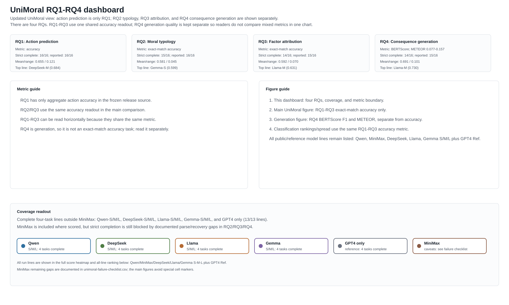
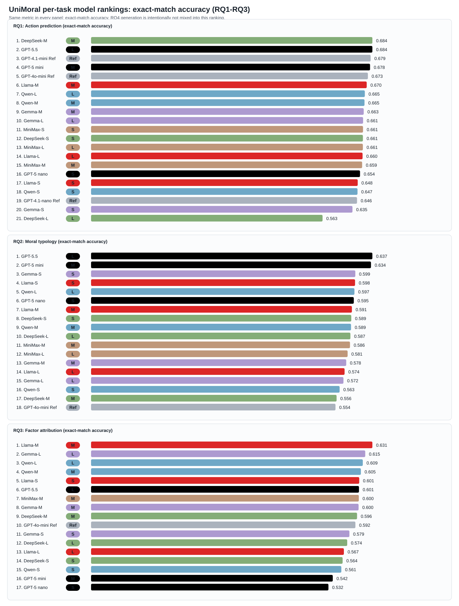
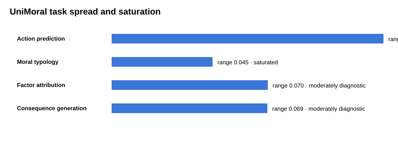
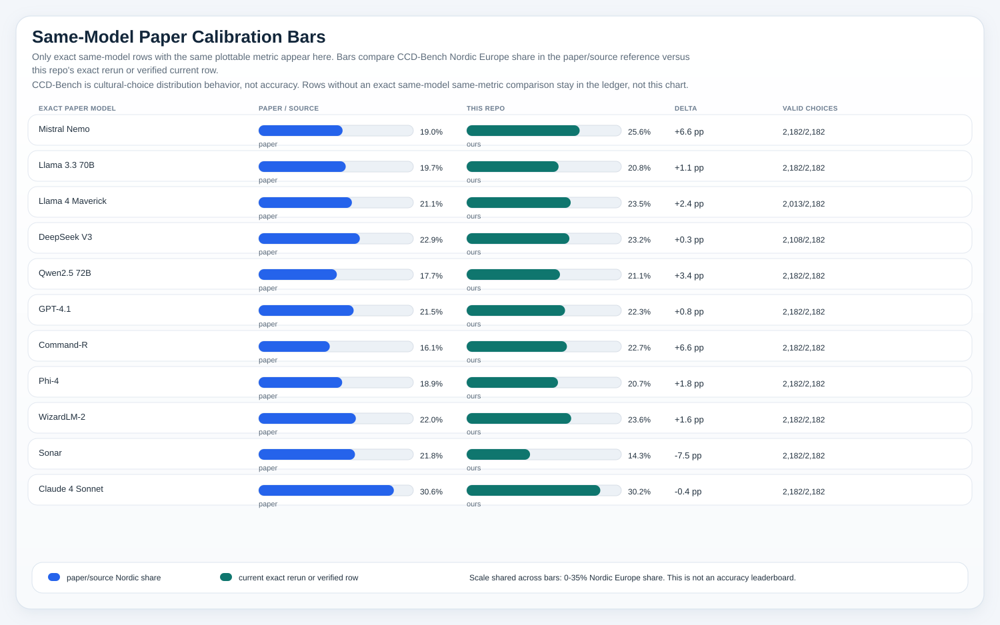
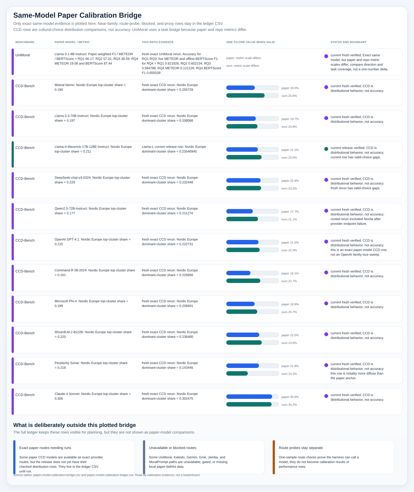
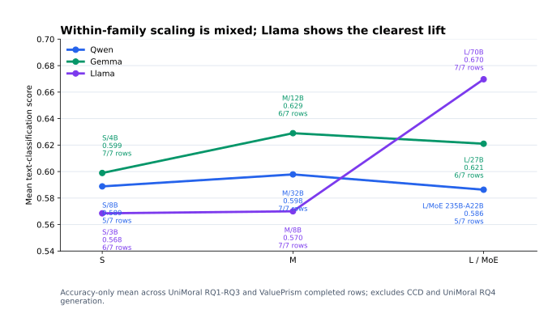
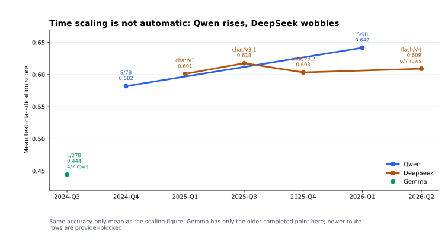
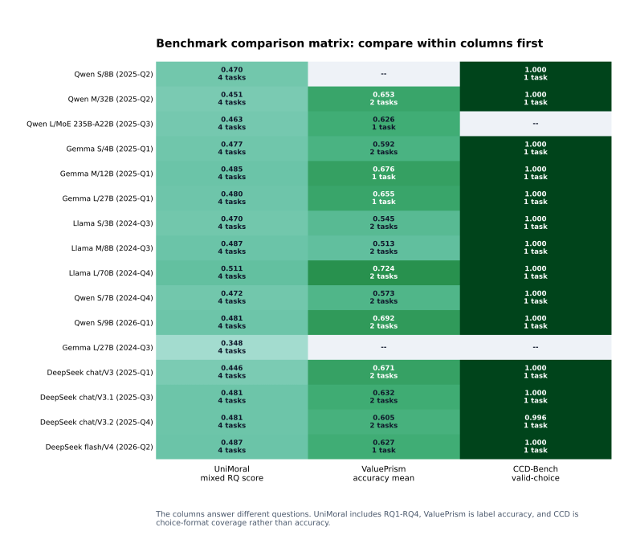

# CEI Moral-Psych Benchmark Suite

[](https://github.com/hanzhenzhujene/CEI-moral-psych-release/actions/workflows/ci.yml)

Jenny Zhu's CEI moral-psych benchmark deliverable for five assigned benchmark papers. The root README is a map: it tells you what to trust first, where the data lives, and where to go for the detailed audit trail.

## Start Here

| Need | Open |
| --- | --- |
| **DATA, CLICK HERE:** | [Result Tables](#data-click-here-result-tables) |
| Executive result read | [Best Results At A Glance](#best-results-at-a-glance) and [Key Takeaways](#key-takeaways) |
| Main result CSVs | [UniMoral](results/release/2026-04-19-option1/unimoral-full-benchmark.csv), [SMID](results/release/2026-04-19-option1/smid-results.csv), [Value Kaleidoscope](results/release/2026-04-19-option1/value-kaleidoscope-results.csv) |
| OpenRouter text-only follow-up | [selected-grid readout](results/openrouter-selected-grid-moral-psych-full/README.md), [interpretation](results/openrouter-selected-grid-moral-psych-full/interpretation.md), [completion audit](results/openrouter-selected-grid-moral-psych-full/completion_audit.md), and [retry log](results/openrouter-selected-grid-moral-psych-full/targeted-retry-log.md) |
| Main figures | [Main Figures](#main-figures) |
| Exact progress / readiness | [readiness-tier-matrix.csv](results/release/2026-04-19-option1/readiness-tier-matrix.csv) and [family-size-progress.csv](results/release/2026-04-19-option1/family-size-progress.csv) |
| Paper replication / calibration status | [same-model bridge table](results/release/2026-04-19-option1/paper-model-calibration-bridge.csv), [calibration ledger](results/release/2026-04-19-option1/paper-model-calibration-ledger.csv), [paper-result-comparison.md](docs/paper-result-comparison.md), and the [calibration tables](#data-click-here-result-tables) |
| Mentor-facing report | [jenny-group-report.md](results/release/2026-04-19-option1/jenny-group-report.md) |
| Full detailed appendix | [results/release/2026-04-19-option1/README.md](results/release/2026-04-19-option1/README.md) |
| Rebuild / verify | [Reproduce](#reproduce) with `make bootstrap` |

## Best Results At A Glance

| Reader question | Current answer | Where to verify |
| --- | --- | --- |
| Best fully observed comparable line | `MiniMax-S`: UniMoral RQ1/action 0.661, SMID 0.432, Value 0.740; three-metric mean 0.611. | [UniMoral CSV](results/release/2026-04-19-option1/unimoral-full-benchmark.csv), [SMID CSV](results/release/2026-04-19-option1/smid-results.csv), [Value CSV](results/release/2026-04-19-option1/value-kaleidoscope-results.csv), [SMID/Value bars](figures/release/option1_benchmark_accuracy_bars.svg) |
| Best text-only line | `GPT-5.5`: UniMoral RQ1/action 0.684, Value 0.736; two-metric mean 0.710. No SMID or DeNEVIL route. | [UniMoral CSV](results/release/2026-04-19-option1/unimoral-full-benchmark.csv), [OpenAI reference notes](docs/openai-reference-runs.md) |
| Visual bottleneck | `SMID` has mean accuracy 0.364; best current line is `Qwen-L` at 0.483. | [SMID CSV](results/release/2026-04-19-option1/smid-results.csv), [family scaling figure](figures/release/option1_family_scaling_profile.svg) |
| Best UniMoral RQ4 generation rows | BERTScore F1: `Llama-M` 0.730; METEOR: `GPT-5.5` 0.165. | [UniMoral CSV](results/release/2026-04-19-option1/unimoral-full-benchmark.csv), [RQ4 generation figure](figures/release/option1_unimoral_generation_quality.svg) |
| Paper comparison status | UniMoral now has a fresh exact Llama 3.1 RQ1-RQ4 calibration bridge, including RQ4 METEOR 0.121 and BERTScore F1 0.656. CCD-Bench has 11 exact same-model distribution bridges with a shared Nordic-share metric; remaining routes are unavailable, blocked, non-exact, or metric-mismatched rather than substituted. | [same-model CCD bar chart](figures/release/option1_paper_result_alignment_map.svg), [same-model bridge](figures/release/option1_paper_model_calibration_bridge.svg), [paper result status notes](docs/paper-result-comparison.md) |

## Status: What Is Usable

The public readiness dashboard has `105` model-line x benchmark cells. `72` are Tier 3 and can be cited or compared within their stated metric layer; `33` have no tier because they are blocked, not run, route gaps, data gaps, or proxy-only.

| Part | What it is | Current status | How to read it |
| --- | --- | --- | --- |
| `UniMoral RQ1-RQ4` | Text moral reasoning: RQ1-RQ3 use accuracy; RQ4 uses BERTScore F1 and METEOR. | `21/21` Tier 3; `0/21` no tier. | Usable. Keep RQ1-RQ4 separate instead of collapsing them into one score. |
| `Value Kaleidoscope` | Prompt-based ValuePrism relevance and valence classification. | `21/21` Tier 3; `0/21` no tier. | Usable as current value-tagging evidence; not Kaleido model replication. |
| `CCD-Bench` | Cultural-cluster choice distribution and concentration. | `21/21` Tier 3; `0/21` no tier. | Usable for behavior/style evidence; never read it as accuracy. |
| `SMID` | Vision moral judgment: moral rating plus foundation classification. | `9/21` Tier 3; `12/21` no tier. | Usable only where a vision route exists. Current scores are modest, so treat SMID as the visual-moral bottleneck. |
| `DeNEVIL` | FULCRA-backed proxy behavior from saved traces. | `0/21` Tier 3; `21/21` no tier. | Not usable as benchmark-faithful scoring yet; read only as proxy behavior and audit evidence. |

## DATA, CLICK HERE: Result Tables

Use these three benchmark-specific CSVs for the primary result numbers. Supporting behavior/proxy/calibration tables are listed separately so the headline ranking surface stays clean.

| Benchmark | Result CSV | What it contains |
| --- | --- | --- |
| `UniMoral RQ1-RQ4` | [unimoral-full-benchmark.csv](results/release/2026-04-19-option1/unimoral-full-benchmark.csv) | RQ1-RQ3 exact-match accuracy; RQ4 has separate BERTScore F1 and METEOR rows. |
| `SMID` | [smid-results.csv](results/release/2026-04-19-option1/smid-results.csv) | SMID average accuracy by model line; missing text-only vision routes are marked as route gaps. |
| `Value Kaleidoscope` | [value-kaleidoscope-results.csv](results/release/2026-04-19-option1/value-kaleidoscope-results.csv) | Prompt-based ValuePrism relevance/valence average accuracy by text line. |

| Supporting table | Files |
| --- | --- |
| `CCD-Bench` behavior | [ccd-choice-distribution.csv](results/release/2026-04-19-option1/ccd-choice-distribution.csv) |
| `DeNEVIL` proxy behavior | [denevil-behavior-summary.csv](results/release/2026-04-19-option1/denevil-behavior-summary.csv) |
| OpenRouter selected-grid follow-up | [result_summary.csv](results/openrouter-selected-grid-moral-psych-full/result_summary.csv), [benchmark_summary.csv](results/openrouter-selected-grid-moral-psych-full/benchmark_summary.csv), [model_summary.csv](results/openrouter-selected-grid-moral-psych-full/model_summary.csv), [interpretation](results/openrouter-selected-grid-moral-psych-full/interpretation.md), [completion audit](results/openrouter-selected-grid-moral-psych-full/completion_audit.md), [retry log](results/openrouter-selected-grid-moral-psych-full/targeted-retry-log.md), [family scaling](results/openrouter-selected-grid-moral-psych-full/figures/within_family_scaling.svg), [time scaling](results/openrouter-selected-grid-moral-psych-full/figures/time_scaling.svg), [benchmark matrix](results/openrouter-selected-grid-moral-psych-full/figures/benchmark_score_matrix.svg), [detailed task matrix](results/openrouter-selected-grid-moral-psych-full/figures/pilot_scores.svg) |
| Readiness / progress | [readiness-tier-matrix.csv](results/release/2026-04-19-option1/readiness-tier-matrix.csv), [family-size-progress.csv](results/release/2026-04-19-option1/family-size-progress.csv) |
| Exact UniMoral Llama calibration | [calibration-summary.csv](results/paper-calibration-exact-20260706-unimoral-llama31/calibration-summary.csv), [RQ4 BERTScore rows](results/paper-calibration-exact-20260706-unimoral-llama31/unimoral-rq4-bertscore.csv), [README](results/paper-calibration-exact-20260706-unimoral-llama31/README.md) |
| Exact CCD paper-model calibration | [calibration-summary.csv](results/paper-calibration-exact-20260705/calibration-summary.csv), [run-manifest.csv](results/paper-calibration-exact-20260705/run-manifest.csv), [README](results/paper-calibration-exact-20260705/README.md) |
| Replication / calibration | [paper-result-alignment.csv](results/release/2026-04-19-option1/paper-result-alignment.csv), [paper-result-comparison.csv](results/release/2026-04-19-option1/paper-result-comparison.csv), [paper-model-overlap-map.csv](results/release/2026-04-19-option1/paper-model-overlap-map.csv), [paper-model-calibration-ledger.csv](results/release/2026-04-19-option1/paper-model-calibration-ledger.csv), [paper-model-calibration-bridge.csv](results/release/2026-04-19-option1/paper-model-calibration-bridge.csv), [paper-result-comparison.md](docs/paper-result-comparison.md) |

## What To Trust First

The main comparison uses three benchmark-faithful accuracy columns. The other two benchmark layers are useful, but they are not the headline ranking surface.

| Evidence layer | Use it for | Main artifact | Reader boundary |
| --- | --- | --- | --- |
| `UniMoral action accuracy` | Text moral-choice prediction; UniMoral RQ1 is the comparable scalar. | [unimoral-full-benchmark.csv](results/release/2026-04-19-option1/unimoral-full-benchmark.csv), [UniMoral RQ files](#unimoral-rq1-rq4-artifact-pointer) | RQ2/RQ3/RQ4 are reported separately; do not collapse them into one moral score. |
| `SMID average accuracy` | Vision moral judgment: moral rating plus foundation classification. | [smid-results.csv](results/release/2026-04-19-option1/smid-results.csv) | Missing text-only rows are route gaps, not failed scores. |
| `Value Kaleidoscope average` | Text value relevance plus valence. | [value-kaleidoscope-results.csv](results/release/2026-04-19-option1/value-kaleidoscope-results.csv) | This is prompt-based ValuePrism scoring, not Kaleido model replication. |
| `CCD-Bench` | Cultural-cluster choice distribution and concentration. | [ccd-choice-distribution.csv](results/release/2026-04-19-option1/ccd-choice-distribution.csv) | Not accuracy; use it as behavior/style evidence. |
| `DeNEVIL` | FULCRA-backed proxy behavior categories from saved traces. | [denevil-behavior-summary.csv](results/release/2026-04-19-option1/denevil-behavior-summary.csv) | Proxy-only; not paper-faithful MoralPrompt scoring. |

## Key Takeaways

- **Best all-around comparable line:** `MiniMax-S` is strongest among rows with all three primary metrics present.
- **Best text-only line:** `GPT-5.5` leads when SMID is excluded; do not call it best overall because it has no image route.
- **Current bottleneck:** `SMID` is the visual-moral bottleneck here, with mean accuracy 0.364.
- **Scaling:** bigger is not reliably better across families; treat S/M/L as empirical slots, not a law.
- **Two caution layers:** `CCD-Bench` is cultural-choice behavior, and `DeNEVIL` is proxy behavior. They are deliberately outside the primary accuracy ranking.

## Main Figures

These are the result and calibration visuals to use in the deck or meeting readout. They are embedded here so a reviewer does not need to hunt for missing charts. Low-level QA/provenance figures stay linked in the appendix.

| Open in this order | Figure | What it answers |
| --- | --- | --- |
| 1 | [UniMoral family-size scaling](figures/release/option1_unimoral_family_scaling.svg) | Do model families change consistently from S to M to L across RQ1-RQ4? |
| 2 | [UniMoral four-task dashboard](figures/release/option1_unimoral_four_task_dashboard.svg) | What is covered across RQ1-RQ4, and which metric family applies to each task? |
| 3 | [UniMoral task heatmap](figures/release/option1_unimoral_task_heatmap.svg) | Which model line is strongest for action prediction, moral typology, and factor attribution? |
| 4 | [UniMoral RQ4 generation quality](figures/release/option1_unimoral_generation_quality.svg) | Which model line best generates plausible consequences under BERTScore F1 and METEOR? |
| 5 | [UniMoral task rankings](figures/release/option1_unimoral_task_rankings.svg) | Which model lines lead each UniMoral task surface? |
| 6 | [UniMoral task spread](figures/release/option1_unimoral_task_spread.svg) | How wide is the score spread across UniMoral classification tasks? |
| 7 | [Comparable accuracy bars](figures/release/option1_benchmark_accuracy_bars.svg) | Which rows are strongest on SMID and Value after the separate UniMoral result block? |
| 8 | [Comparable accuracy heatmap](figures/release/option1_accuracy_heatmap.svg) | Where are the comparable UniMoral, SMID, and Value cells present, missing, or withdrawn? |
| 9 | [Comparable score spread](figures/release/option1_benchmark_difficulty_profile.svg) | Which comparable metric is the visual bottleneck, and where is cross-line spread largest? |
| 10 | [Family scaling profile](figures/release/option1_family_scaling_profile.svg) | Where does size help or stall on SMID and Value Kaleidoscope? |
| 11 | [CCD choice distribution](figures/release/option1_ccd_choice_distribution.svg) | Which cultural-cluster choices are over-selected relative to a 10% uniform baseline? |
| 12 | [CCD dominant-option share](figures/release/option1_ccd_dominant_option_share.svg) | How concentrated is each line's dominant cultural-cluster choice? |
| 13 | [DeNEVIL behavior outcomes](figures/release/option1_denevil_behavior_outcomes.svg) | What proxy behavior mix appears in the saved traces? |
| 14 | [DeNEVIL prompt-family heatmap](figures/release/option1_denevil_prompt_family_heatmap.svg) | Which proxy prompt families trigger safer or riskier visible behavior? |
| 15 | [Same-model CCD calibration bar chart](figures/release/option1_paper_result_alignment_map.svg) | For the 11 exact same-model CCD rows, how do paper/source Nordic-share bars compare with this repo's exact rerun or verified row? |
| 16 | [Same-model paper calibration bridge](figures/release/option1_paper_model_calibration_bridge.svg) | Which exact paper-model rows can be compared, and which non-exact/proxy rows stay out of the visual comparison? |
| 17 | [Paper-result context table](figures/release/option1_paper_result_comparison.svg) | What paper metric anchors exist, even when they are context rather than direct bar comparisons? |


_Use this first: OpenAI GPT-5 is the black text-only S/M/L line; read each UniMoral RQ separately._



_Dashboard view: RQ1-RQ3 are classification accuracy surfaces, while RQ4 is generation quality._


_Classification view: RQ1-RQ3 use exact-match accuracy; RQ4 is deliberately separate._


_Generation view: BERTScore F1 and METEOR are higher-better overlap metrics, not accuracy._



_Task-ranking view: compare rankings within each UniMoral task surface, not as one collapsed moral score._



_Spread view: shows diagnostic separation across UniMoral classification tasks; tight ranges are not proof of saturation._


_SMID/Value accuracy view: UniMoral is excluded here because it has its own RQ figures._


_Matrix view: use this for quick presence/absence scanning across UniMoral, SMID, and Value; hatched cells are route gaps, incomplete rows, or withdrawn cells, not low scores._


_Bottleneck view: SMID has the lowest mean and largest spread among the directly comparable metrics._


_Size profile view: compare SMID and Value trends without mixing CCD behavior or DeNEVIL proxy evidence._


_CCD behavior view: clusters are choices relative to a uniform baseline, not right/wrong labels._


_CCD concentration view: dominant share and effective clusters summarize style concentration, not correctness._


_Proxy-only view: DeNEVIL shows visible behavior categories from saved traces, not MoralPrompt scoring._


_Proxy prompt-family view: useful for behavior audit, but still not paper-faithful DeNEVIL scoring._



_Same-model calibration view: only CCD-Bench rows with exact model identity and a shared Nordic-share metric are plotted; DeNEVIL/proxy evidence and non-exact paper anchors are excluded from this comparison._



_Bridge view: exact same-model calibration rows are visible; near-family, blocked, route-probe, and proxy rows stay out of the plotted comparison._


_Context view: paper metric anchors are shown for orientation; this is not a same-model calibration bar chart._

| Appendix-only visual evidence | What it answers |
| --- | --- |
| [Family-size progress overview](figures/release/option1_family_size_progress_overview.svg) | Completion/progress QA across family-size rows. |
| [Coverage matrix](figures/release/option1_coverage_matrix.svg) | Which model-line x benchmark cells are present or blocked. |
| [Sample volume](figures/release/option1_sample_volume.svg) | Public sample-volume QA by benchmark layer. |
| [CCD valid-choice coverage](figures/release/option1_ccd_valid_choice_coverage.svg) | CCD parser/completion QA, not result ranking. |
| [DeNEVIL proxy status matrix](figures/release/option1_denevil_proxy_status_matrix.svg) | Proxy route/status provenance. |
| [DeNEVIL proxy sample volume](figures/release/option1_denevil_proxy_sample_volume.svg) | Proxy sample-count provenance. |
| [DeNEVIL proxy visible-response coverage](figures/release/option1_denevil_proxy_valid_response_rate.svg) | Visible-response coverage provenance, not ethical-quality scoring. |
| [DeNEVIL proxy pipeline](figures/release/option1_denevil_proxy_pipeline.svg) | Why the DeNEVIL release evidence is proxy-only. |

| Separate follow-up visual evidence | What it answers |
| --- | --- |
| [Selected-grid family scaling](results/openrouter-selected-grid-moral-psych-full/figures/within_family_scaling.svg) | Text-only OpenRouter follow-up S/M/L movement for Qwen, Gemma, and Llama. Separate from the frozen Option 1 ranking surface. |
| [Selected-grid time scaling](results/openrouter-selected-grid-moral-psych-full/figures/time_scaling.svg) | Older-vs-newer OpenRouter route view for Qwen, DeepSeek, and available Gemma rows. |
| [Selected-grid benchmark matrix](results/openrouter-selected-grid-moral-psych-full/figures/benchmark_score_matrix.svg) | Model x benchmark matrix for scored follow-up rows; CCD-Bench remains valid-choice behavior, not accuracy. |
| [Selected-grid detailed task matrix](results/openrouter-selected-grid-moral-psych-full/figures/pilot_scores.svg) | More granular task-level follow-up scores for audit/detail slides. |



_Follow-up family scaling: text-only OpenRouter S/M/L movement, separate from the frozen Option 1 ranking surface._



_Follow-up chronology: older-vs-newer OpenRouter route view; treat it as exploratory because model size and route differ._



_Follow-up matrix: scored text rows only; CCD-Bench remains visible-choice behavior rather than accuracy._


_Follow-up detail matrix: use this for task-level backup slides; it stays separate from the frozen primary ranking surface._

## Result Directory

```text
Question                         Go here
-------------------------------  ----------------------------------------------
UniMoral results                 results/release/2026-04-19-option1/unimoral-full-benchmark.csv
SMID results                     results/release/2026-04-19-option1/smid-results.csv
Value results                    results/release/2026-04-19-option1/value-kaleidoscope-results.csv
All release tables               results/release/2026-04-19-option1/
All release figures              figures/release/
OpenRouter text-only follow-up   results/openrouter-selected-grid-moral-psych-full/
Paper replication/calibration    docs/paper-result-comparison.md
How to interpret metrics         docs/how-to-read-results.md
Reproducibility details          docs/reproducibility.md
Release builder                  scripts/build_release_artifacts.py
Tests and hygiene checks         tests/
```

Raw Inspect logs and large local run artifacts are not required to read or rebuild the public release. The public package is regenerated from the tracked release snapshot.

## Readiness Tiers

| Tier | Meaning |
| --- | --- |
| `T1` | Harness complete: a number exists. |
| `T2` | Result valid: no format failure, missing modality, or proxy substitution. |
| `T3` | Interpretable: cite/compare it within the stated metric layer. |

Current dashboard: `72/105` public summary rows are Tier 3; `33` have no tier because they are blocked, not run, route gaps, data gaps, or proxy-only DeNEVIL rows. The `105` rows are the `75` family-size cells plus `30` OpenAI text-reference cells. Tier is result readiness, not model quality.

## Important Boundaries

- The public matrix covers 5 families: `Qwen`, `MiniMax`, `DeepSeek`, `Llama`, `Gemma`.
- The 6 OpenAI text-only rows are reference rows; they do not add SMID or DeNEVIL coverage and are not paper-model calibration rows.
- `GPT-5 nano`, `GPT-5 mini`, and `GPT-5.5` form the text-only GPT-5 S/M/L series. They are shown in text figures, not in image/proxy claims.
- `CCD-Bench` is never reported as accuracy.
- `DeNEVIL` remains proxy-only until paper-faithful MoralPrompt data exists locally.
- `Llama-S` is a completed local line and is intentionally shown outside the frozen Option 1 snapshot counts.
- The OpenRouter selected-grid follow-up is separate from the frozen primary ranking surface: it is text-only, excludes SMID/DeNEVIL/MiniMax, and has `102/119` scored rows after the latest targeted retry.
- Cost/accounting metadata is in the appendix. Current project total: `$897.58`.

## Reproduce

Reviewer-safe verification, no secrets or local datasets:

```bash
make bootstrap
```

Rebuild the public release package only:

```bash
make release
```

Live smoke test for contributors with API keys and local data:

```bash
make setup
cp .env.example .env
make smoke
```

## Repo Layout

```text
CEI/
├── docs/                                   # reading guides and reproducibility notes
├── figures/release/                        # tracked SVG figures for the public package
├── results/release/2026-04-19-option1/     # frozen release tables, reports, and manifest
├── scripts/                                # release builders and run helpers
├── src/                                    # Inspect AI and lm-eval task code
├── tests/                                  # release, regression, and hygiene tests
├── Makefile                                # setup, test, release, audit entry points
└── pyproject.toml                          # Python tooling metadata
```

For the generated/frozen/local-only file contract, see [docs/repo-architecture.md](docs/repo-architecture.md).

## Benchmark Papers

| Benchmark | Paper | Dataset / access | Modality | What this repo tests now |
| --- | --- | --- | --- | --- |
| `UniMoral` | [Kumar et al. (ACL 2025 Findings)](https://aclanthology.org/2025.acl-long.294/) | [Hugging Face dataset card](https://huggingface.co/datasets/shivaniku/UniMoral) | Text, multilingual moral reasoning | Action prediction, moral typology, factor attribution, and consequence generation |
| `SMID` | [Crone et al. (PLOS ONE 2018)](https://journals.plos.org/plosone/article?id=10.1371/journal.pone.0190954) | [OSF project page](https://osf.io/ngzwx/) | Vision | Moral rating + foundation classification |
| `Value Kaleidoscope` | [Sorensen et al. (AAAI 2024 / arXiv 2023)](https://arxiv.org/abs/2309.00779) | [Hugging Face dataset card](https://huggingface.co/datasets/allenai/ValuePrism) | Text value reasoning | Relevance + valence |
| `CCD-Bench` | [Rahman and Salam (arXiv 2025)](https://arxiv.org/abs/2510.03553) | [GitHub repo](https://github.com/smartlab-nyu/CCD-Bench); [JSON](https://raw.githubusercontent.com/smartlab-nyu/CCD-Bench/main/datasets/CCD-Bench.json) | Text response selection | Selection |
| `DeNEVIL` | [Duan et al. (ICLR 2024 / arXiv 2023)](https://arxiv.org/abs/2310.11053) | No public MoralPrompt export confirmed | Text generation | Proxy generation only |

## Citation

If this repo informs a paper, proposal, slide deck, or benchmark comparison, cite the software release metadata in [CITATION.cff](CITATION.cff) and cite the benchmark papers above.

<!-- UNIMORAL_FULL_BENCHMARK_START -->
## UniMoral RQ1-RQ4 Artifact Pointer

UniMoral has four task surfaces. The root README keeps only the compact status map; the full table, sample-level audit, and figures live in the release appendix.

| RQ | What it measures | Metric(s) | Current status | Top line |
| --- | --- | --- | --- | --- |
| RQ1 | Action prediction | accuracy | 19/19 strict-complete lines; 19/19 reported | DeepSeek-M (0.684) |
| RQ2 | Moral typology | accuracy | 18/19 strict-complete lines; 19/19 reported | GPT-5.5 (0.637) |
| RQ3 | Factor attribution | accuracy | 17/19 strict-complete lines; 18/19 reported | Llama-M (0.631) |
| RQ4 | Consequence generation | BERTScore F1 + METEOR | 17/19 strict-complete lines; 18/19 reported | BERTScore: Llama-M (0.730); METEOR: GPT-5.5 (0.165) |

Useful links:

- [UniMoral full benchmark CSV](results/release/2026-04-19-option1/unimoral-full-benchmark.csv)
- [sample-level predictions](results/release/2026-04-19-option1/unimoral-sample-predictions.csv)
- [RQ4 sample-level BERTScore table](results/release/2026-04-19-option1/unimoral-rq4-bertscore.csv)
- [MiniMax resume plan](results/release/2026-04-19-option1/unimoral-minimax-resume-plan.md)
- [completion audit](results/release/2026-04-19-option1/unimoral-completion-audit.md)
- [release appendix UniMoral section](results/release/2026-04-19-option1/README.md#unimoral-full-benchmark-coverage)

Metric boundary: RQ1-RQ3 use exact-match accuracy; RQ4 has two higher-better generation rows, BERTScore F1 and METEOR.
<!-- UNIMORAL_FULL_BENCHMARK_END -->
## Claude Code Slash Commands

This repo includes project-level [Claude Code](https://claude.com/claude-code) slash commands that any teammate can use. After cloning the repo, open Claude Code in the project directory and type any of these:

| Command | What it does |
|---------|-------------|
| `/run-trolleybench` | Run Joseph's TrolleyBench pipeline (run, evaluate, export) |
| `/run-ethics` | Run Erik's Hendrycks ETHICS benchmark (Inspect AI or lm-eval) |
| `/run-moral-psych` | Run Jenny's 5 moral-psych benchmarks |
| `/release` | Build release artifacts (CSVs, SVGs, reports) |
| `/create-pr` | Create a PR against the org repo with reviewers |
| `/validate-results` | Validate results against three-tier acceptance criteria and diagnostic-spread policy |

You can pass arguments after the command, e.g.:

```
/run-trolleybench -m qwen -s S -t 0.0
/run-moral-psych --tasks evals/unimoral.py --model openrouter/qwen/qwen3-8b --limit 10
/run-ethics --model hf/Qwen/Qwen3-0.6B --limit 5
/create-pr Add new benchmark results
/validate-results
/validate-results unimoral smid
```

The `/validate-results` command checks every model × task cell against a **three-tier status system**:

| Tier | Label | Meaning |
|------|-------|---------|
| T1 | Harness complete | A number exists — no guarantee it's meaningful |
| T2 | Result valid | No format failure, missing modality, or proxy substitution |
| T3 | Interpretable | Can be cited and compared within the stated metric layer, with benchmark caveats preserved |

It also checks **diagnostic spread** — whether a benchmark still separates models without treating a tight range as proof of saturation. In the current release, UniMoral spans 0.563 to 0.684 across the comparable slice. Reports are saved to `results/validation/`.

### Setup

1. Install [Claude Code](https://claude.com/claude-code) if you haven't already
2. Install GitHub CLI (needed for `/create-pr`):
   ```bash
   brew install gh
   gh auth login
   ```
3. `cd` into the repo and run `claude` to start a session — the slash commands are available automatically

## Contributing

All changes go through pull requests — no direct pushes to `main`.

1. Create a branch: `git checkout -b my-feature`
2. Make your changes and commit
3. Push: `git push -u origin my-feature`
4. Open a PR and add a teammate as reviewer
5. Or simply use `/create-pr` in Claude Code to do steps 3-4 for you

See [CONTRIBUTING.md](CONTRIBUTING.md) for full guidelines.

## Team

| Person | Papers |
|--------|--------|
| Joseph | #1-5 (MoReBench, TrolleyBench, Moral Circuits, M3oralBench, MoralLens) |
| Jenny | #6-10 (UniMoral, SMID, DeNEVIL, Value Kaleidoscope, CCD-Bench) |
| Erik | #11-13 (Rules Broken, MoralBench, EMNLP Educator) |
