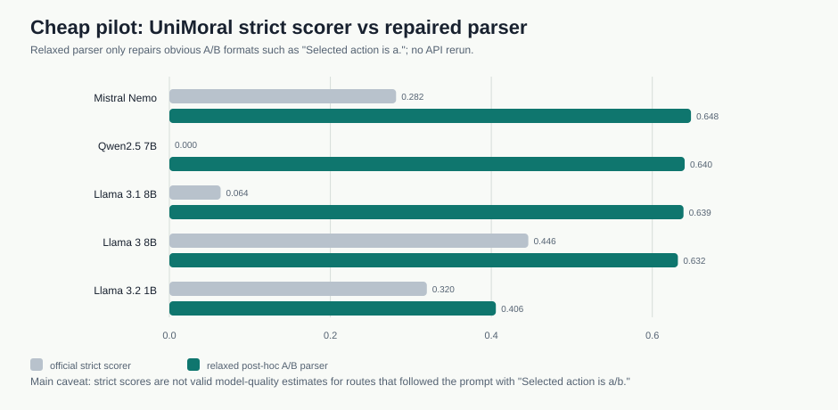
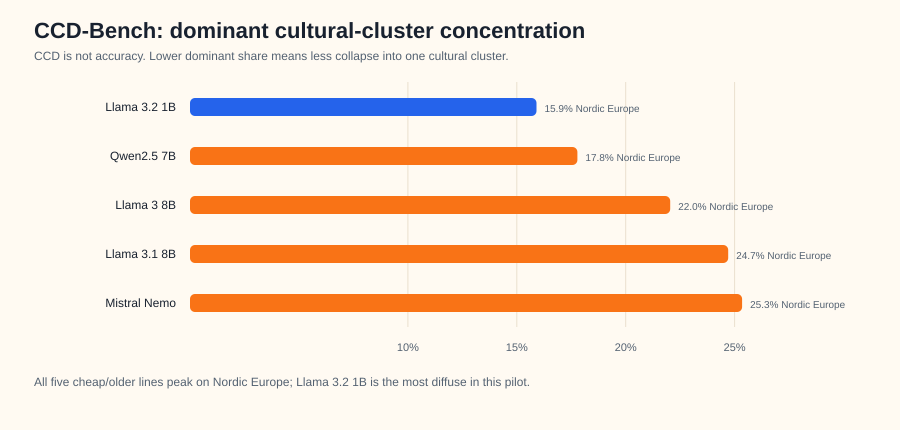
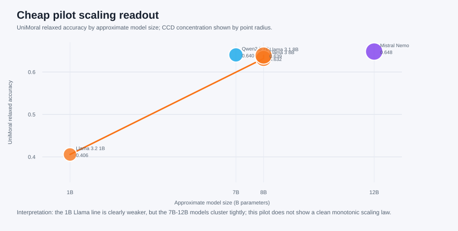

# Cheap Model Pilot: UniMoral + CCD-Bench

Date: 2026-05-13

This exploratory sweep tested cheaper/older OpenRouter routes on the two lowest-cost Jenny benchmarks selected for follow-up: UniMoral action prediction and CCD-Bench cultural choice style. It is intentionally separate from the main Option 1 release package.

## Key Findings

- Best UniMoral relaxed result: **Mistral Nemo** at **0.648**.
- Weakest UniMoral relaxed result: **Llama 3.2 1B** at **0.406**; this is the only clear low-performing line.
- The official strict UniMoral scorer badly undercounts several routes because many models followed the prompt as `Selected action is a/b.`, while the strict scorer expected narrower answer formats.
- CCD-Bench is **not accuracy**. All five lines peak on **Nordic Europe**, but concentration differs: **Llama 3.2 1B** is most diffuse at **15.9%**, while **Mistral Nemo** is most concentrated at **25.3%**.
- Scaling readout: there is **no clean monotonic scaling law** in this cheap pilot. Llama 3.2 1B is much weaker on UniMoral, but the 7B-12B models are tightly clustered.

## Interpretation

**Model-wise:** Mistral Nemo, Qwen2.5 7B, Llama 3.1 8B, and Llama 3 8B are tightly clustered on UniMoral. Llama 3.2 1B is clearly weaker.

**Benchmark-wise:** UniMoral exposed a scorer/parser issue, so I report strict and relaxed saved-log parsing separately. CCD-Bench is not accuracy; it shows cultural choice concentration. All models peak on Nordic Europe, but Llama 3.2 1B is most diffuse and Mistral Nemo is most concentrated.

**Scaling-wise:** There is no clean monotonic scaling law. The 1B model is much worse, but above about 7B the results cluster closely rather than improving smoothly with size.

## Result Tables

### UniMoral

| Model | Official strict acc. | Relaxed acc. | Answer rate | Strict blanks recovered |
|---|---:|---:|---:|---:|
| Mistral Nemo | 0.282 | 0.648 | 0.999 | 4939 |
| Qwen2.5 7B | 0.000 | 0.640 | 1.000 | 8783 |
| Llama 3.1 8B | 0.064 | 0.639 | 0.993 | 7872 |
| Llama 3 8B | 0.446 | 0.632 | 1.000 | 2633 |
| Llama 3.2 1B | 0.320 | 0.406 | 0.736 | 1731 |

### CCD-Bench

| Model | Valid choice rate | Dominant cluster | Dominant share | Effective clusters |
|---|---:|---|---:|---:|
| Mistral Nemo | 0.998 | Nordic Europe | 0.253 | 7.22 |
| Llama 3.1 8B | 1.000 | Nordic Europe | 0.247 | 7.14 |
| Llama 3 8B | 1.000 | Nordic Europe | 0.220 | 7.91 |
| Qwen2.5 7B | 1.000 | Nordic Europe | 0.178 | 8.78 |
| Llama 3.2 1B | 1.000 | Nordic Europe | 0.159 | 9.12 |

## Figures

## Metric Boundary

- UniMoral relaxed accuracy is a post-hoc parser repair over saved logs only; it does not spend new API credit.
- CCD-Bench reports cultural-choice distribution and concentration, not correctness.
- This is an exploratory pilot, not a replacement for the main release matrix.
