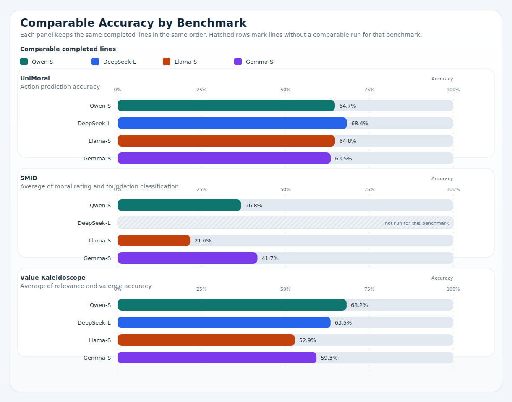
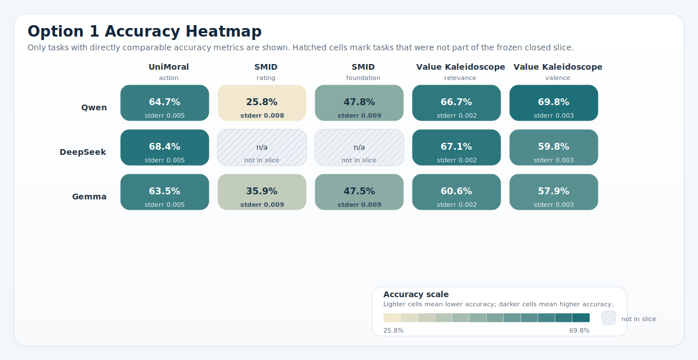
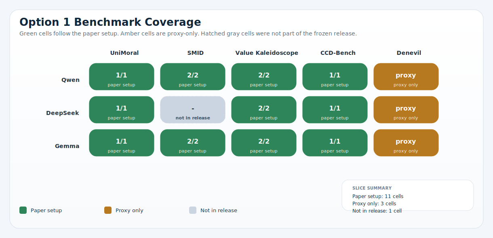
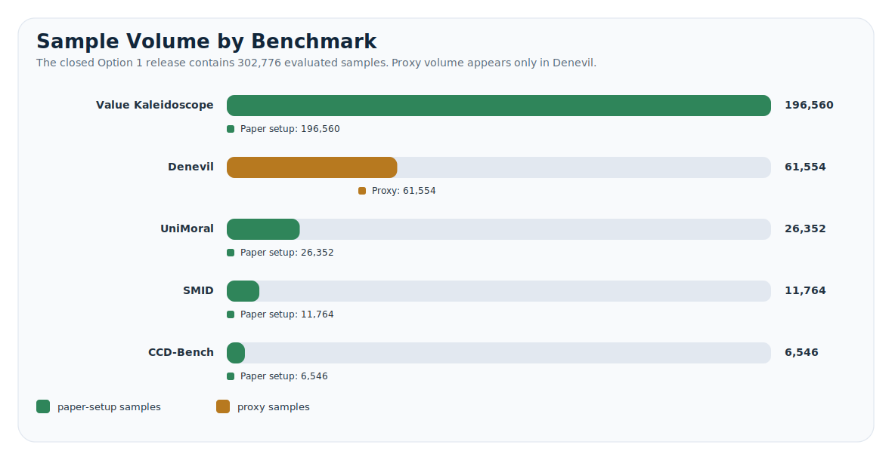

# Option 1 Release Artifacts

This directory contains the tracked, publication-facing outputs for Jenny Zhu's CEI moral-psych deliverable.

It separates two things clearly:

1. the frozen `Option 1` public snapshot from `April 19, 2026`, and
2. the wider `5 benchmarks x 5 model families x 3 size slots` progress matrix that is still being filled in.

## Snapshot

| Field | Value |
| --- | --- |
| Report owner | `Jenny Zhu` |
| Repo update date | `April 20, 2026` |
| Frozen public snapshot | `Option 1`, `April 19, 2026` |
| Current cost to date | `$35` |
| Intended use | Jenny Zhu's group-facing progress report for the April 14, 2026 five-benchmark moral-psych plan. |
| Agreed target matrix | `5 benchmarks x 5 model families x 3 size slots = 75 family-size-benchmark cells` |
| Benchmarks in scope | `UniMoral`, `SMID`, `Value Kaleidoscope`, `CCD-Bench`, `Denevil` |
| Agreed model families | `Qwen`, `MiniMax`, `DeepSeek`, `Llama`, `Gemma` |
| Frozen families already in Option 1 | `Qwen`, `DeepSeek`, `Gemma` |
| Extra completed local line outside release | `Llama` small via `llama-3.2-11b-vision-instruct`, complete across `5` papers / `7` tasks |
| MiniMax small status | formal attempt exists, but the current run failed and is not counted as complete |
| Provider / temperature | `OpenRouter`, `temperature=0` |
| Current operations note | Updated April 20, 2026. The frozen public snapshot is still Option 1 from April 19. The image queue is complete, Qwen-L SMID recovery is complete on qwen2.5-vl-72b with a non-Alibaba provider allowlist, Gemma-L is still running the Denevil proxy task, and the Gemma-M / Qwen-M text batches are now live locally. |
| CI reference | [Workflow](https://github.com/hanzhenzhujene/CEI-moral-psych-release/actions/workflows/ci.yml); last verified successful run: [run 24634450927](https://github.com/hanzhenzhujene/CEI-moral-psych-release/actions/runs/24634450927) |

## Local Expansion Checkpoint

| Line or batch | Status | Note |
| --- | --- | --- |
| `Qwen-L SMID recovery` | Done | Completed April 20, 2026 via openrouter/qwen/qwen2.5-vl-72b-instruct after the earlier qwen3-vl-32b moderation stop. |
| `Gemma-L text batch` | Live | UniMoral, Value Kaleidoscope, and CCD-Bench are done; Denevil proxy generation is still running locally. |
| `Gemma-M text batch` | Live | The medium non-image batch is live locally and started from UniMoral; the Gemma-M SMID line was already complete. |
| `Qwen-M text batch` | Live | The medium non-image batch is live locally and started from UniMoral; the Qwen-M SMID route is still TBD. |
| `Llama-L SMID` | Done | The large Llama vision line is complete locally. |
| `Next queued text lines` | Queue | Qwen-L text, Llama-M, Llama-L, MiniMax-M, DeepSeek-M, and MiniMax-L remain queued after the active Gemma / Qwen medium batches. |

## Open These First

- `jenny-group-report.md`: mentor-facing report with the benchmark list, progress matrix, model roster, and current results
- `topline-summary.md`: shortest narrative summary of the frozen Option 1 snapshot
- `release-manifest.json`: machine-readable release index
- [how to read the results](../../../docs/how-to-read-results.md): plain-language explanation of the report terms
- [grouped bar chart](../../../figures/release/option1_benchmark_accuracy_bars.svg): current cross-model benchmark comparison
- [accuracy heatmap](../../../figures/release/option1_accuracy_heatmap.svg): task-level view of comparable metrics
- [coverage matrix](../../../figures/release/option1_coverage_matrix.svg): frozen Option 1 coverage only
- [sample volume chart](../../../figures/release/option1_sample_volume.svg): where the evaluated samples are concentrated

## Progress Legend

- `done`: benchmark line finished with a usable result
- `proxy`: finished, but only with a substitute proxy dataset instead of the paper's original setup
- `live`: currently running
- `error`: formal attempt exists, but the current result is not usable
- `queue`: approved and queued next
- `tbd`: family-size route is not frozen yet
- `-`: no run is planned on that line right now

## Family-Size Progress Matrix

This is the cleanest repo-level summary of where the full `5 x 5 x 3` plan stands today.

| Line | UniMoral | SMID | Value Kaleidoscope | CCD-Bench | Denevil | Note |
| :--- | :---: | :---: | :---: | :---: | :---: | --- |
| `Qwen-S` | Done | Done | Done | Done | Proxy | Frozen Option 1 line. |
| `Qwen-M` | Live | TBD | Queue | Queue | Queue | Text batch is live locally; UniMoral is in progress and no medium SMID route is fixed yet. |
| `Qwen-L` | Queue | Done | Queue | Queue | Queue | SMID recovery is complete on qwen2.5-vl-72b; the large text line is still queued. |
| `MiniMax-S` | Error | Error | Error | Error | Error | Attempted, but key-limit failures made the line unusable. |
| `MiniMax-M` | Queue | TBD | Queue | Queue | Queue | Text queued; no medium SMID route is fixed yet. |
| `MiniMax-L` | Queue | TBD | Queue | Queue | Queue | Text queued; no large SMID route is fixed yet. |
| `DeepSeek-S` | TBD | - | TBD | TBD | TBD | Small baseline not frozen; no vision route is in scope. |
| `DeepSeek-M` | Queue | - | Queue | Queue | Queue | Text queued; no vision route is in scope. |
| `DeepSeek-L` | Done | - | Done | Done | Proxy | Frozen large text line; no SMID route was included. |
| `Llama-S` | Done | Done | Done | Done | Proxy | Complete locally across all five papers. |
| `Llama-M` | Queue | - | Queue | Queue | Queue | Text queued; no SMID run is planned. |
| `Llama-L` | Queue | Done | Queue | Queue | Queue | SMID done; text is still queued. |
| `Gemma-S` | Done | Done | Done | Done | Proxy | Frozen Option 1 recovery line. |
| `Gemma-M` | Live | Done | Queue | Queue | Queue | Text batch is live locally; UniMoral is in progress and SMID is already complete. |
| `Gemma-L` | Done | Done | Done | Done | Live | UniMoral, SMID, Value, and CCD are done; Denevil is live. |

## Benchmark List

| Benchmark | Paper | Dataset / access | Modality | What this repo tests now |
| --- | --- | --- | --- | --- |
| `UniMoral` | [Kumar et al. (ACL 2025 Findings)](https://aclanthology.org/2025.acl-long.294/) | [Hugging Face dataset card](https://huggingface.co/datasets/shivaniku/UniMoral) | Text, multilingual moral reasoning | Action prediction only |
| `SMID` | [Crone et al. (PLOS ONE 2018)](https://journals.plos.org/plosone/article?id=10.1371/journal.pone.0190954) | [OSF project page](https://osf.io/ngzwx/) | Vision | Moral rating + foundation classification |
| `Value Kaleidoscope` | [Sorensen et al. (AAAI 2024 / arXiv 2023)](https://arxiv.org/abs/2310.17681) | [Hugging Face dataset card](https://huggingface.co/datasets/allenai/ValuePrism) | Text value reasoning | Relevance + valence |
| `CCD-Bench` | [Rahman et al. (arXiv 2025)](https://arxiv.org/abs/2510.03553) | [GitHub repo](https://github.com/smartlab-nyu/CCD-Bench); [JSON](https://raw.githubusercontent.com/smartlab-nyu/CCD-Bench/main/datasets/CCD-Bench.json) | Text response selection | Selection |
| `Denevil` | [Duan et al. (ICLR 2024 submission / arXiv 2023)](https://arxiv.org/abs/2310.11905) | No public MoralPrompt export confirmed | Text generation | Proxy generation only |

## Current Comparable Accuracy Snapshot

Only benchmarks with directly comparable accuracy metrics are shown here. `CCD-Bench` and `Denevil` are excluded from this table because they do not share the same target metric across lines.

| Line | UniMoral action | SMID average | Value Kaleidoscope average | Coverage note |
| :--- | ---: | ---: | ---: | --- |
| `Qwen-S` | 0.647 | 0.368 | 0.682 | Frozen Option 1 line. |
| `DeepSeek-L` | 0.684 | n/a | 0.635 | Frozen large-class text line. No SMID vision route was included. |
| `Llama-S` | 0.648 | 0.216 | 0.529 | Complete locally across all five papers, but still outside the frozen Option 1 snapshot counts. |
| `Gemma-S` | 0.635 | 0.417 | 0.593 | Frozen Option 1 recovery line. |

## Figure Gallery



_Figure 1. Benchmark-level accuracy comparison across the currently completed comparable lines._



_Figure 2. Task-level accuracy heatmap for the frozen Option 1 slice._



_Figure 3. Coverage matrix showing which benchmark lines are paper-setup, proxy-only, or absent from the frozen release._



_Figure 4. Sample volume by benchmark, with paper-setup and proxy samples separated for readability._

## Frozen Option 1 Model Summary

| Model family | Paper-setup tasks | Proxy tasks | Samples | Paper-setup macro accuracy |
| :--- | ---: | ---: | ---: | ---: |
| `Qwen` | 6 | 1 | 102,886 | 0.550 |
| `DeepSeek` | 4 | 1 | 97,004 | 0.651 |
| `Gemma` | 6 | 1 | 102,886 | 0.531 |

## Files

- `source/authoritative-summary.csv`: tracked frozen source snapshot for the April 19 release
- `jenny-group-report.md`: mentor-ready markdown report
- `topline-summary.md`: concise release narrative
- `release-manifest.json`: machine-readable index of counts, files, and caveats
- `family-size-progress.csv`: 15-line matrix for the full five-family by three-size plan
- `benchmark-comparison.csv`: current comparable accuracy table used for the grouped bar figure
- `benchmark-catalog.csv`: benchmark registry with paper and dataset links
- `model-roster.csv`: exact OpenRouter routes in the frozen Option 1 snapshot
- `supplementary-model-progress.csv`: extra local lines outside the frozen snapshot counts

## Regeneration

From the repo root:

```bash
make release
make audit
```

`make release` rebuilds this public package from the tracked source snapshot. `make audit` runs the public QA gate and rebuilds the package together.

## Interpretation Notes

- The full `5 x 5 x 3` plan is the target matrix, not a claim of completed coverage.
- The frozen `Option 1` snapshot still only includes `Qwen`, `DeepSeek`, and `Gemma`.
- `Llama-S` is complete locally and is shown in comparison tables, but it remains outside the frozen snapshot counts.
- `MiniMax-S` has a formal attempt on disk, but it is still an error line rather than a finished comparison point.
- `Denevil` is still proxy-only in the current public release because the paper-faithful `MoralPrompt` export is not available locally.
